# HireTrack

HireTrack is a full-stack Django web application designed to help users organise and track their job applications throughout the recruitment process.

Users can create an account, securely log in, add and manage job applications, update application statuses, and monitor their job search through a personalised dashboard.

---

## 🔗 Live Site  
https://hiretrackerheroku-98519fb8f772.herokuapp.com/

## 🔗 GitHub Repository  
https://github.com/queldx74/HireTrack

---

# Table of Contents
- [Project Overview](#project-overview)
- [Project Goals](#project-goals)
- [User Experience](#user-experience)
  - Target Audience  
  - User Goals  
  - User Stories  
- [Design](#design)
  - Wireframes  
  - Mockups  
  - Design Rationale  
  - Responsive Design  
  - Accessibility  
- [Agile Development](#agile-development)
- [Features](#features)
- [Data Model](#data-model)
- [CRUD Functionality](#crud-functionality)
- [Authentication and Authorization](#authentication-and-authorization)
- [Forms and Validation](#forms-and-validation)
- [User Feedback and Notifications](#user-feedback-and-notifications)
- [Business Logic](#business-logic)
- [Technologies Used](#technologies-used)
- [Testing Summary](#testing-summary)
- [Security](#security)
- [Deployment](#deployment)
- [AI Usage](#ai-usage)
- [Version Control](#version-control)
- [Credits](#credits)
- [Acknowledgements](#acknowledgements)

---

# Project Overview

HireTrack provides job seekers with a simple and organised way to manage their job applications.  
Instead of relying on spreadsheets or notes, users can store applications in one location and track progress through different recruitment stages.

The application is built using Django and uses a persistent PostgreSQL database.

---

# Project Goals

HireTrack aims to:

- Allow users to securely register, log in, and log out  
- Allow users to create, read, update, and delete job applications  
- Ensure users can only access their own data  
- Track applications through recruitment stages  
- Provide a dashboard overview  
- Provide clear feedback after database changes  
- Deliver an accessible, responsive interface across all devices  

---

# User Experience

## Target Audience
Job seekers applying for multiple roles who need a central place to organise and monitor applications.

## User Goals
Users should be able to:

- Record new job applications quickly  
- View all applications  
- Track progress  
- Update application status  
- Delete applications  
- Access data securely  
- Understand job-search progress via dashboard  

## User Stories

### Authentication
- As a new user, I want to register for an account.  
- As a registered user, I want to log in securely.  
- As a logged-in user, I want to log out.

### Job Applications
- As a user, I want to create a job application.  
- As a user, I want to view my applications.  
- As a user, I want to view an individual application.  
- As a user, I want to edit an application.  
- As a user, I want to delete an application.  
- As a user, I want to update an application's status.

### Privacy
- As a user, I want my applications to remain private.

### Dashboard
- As a user, I want to see a summary of my applications.

### Filtering
- As a user, I want to filter applications by status.

---

# Design

## Wireframes  
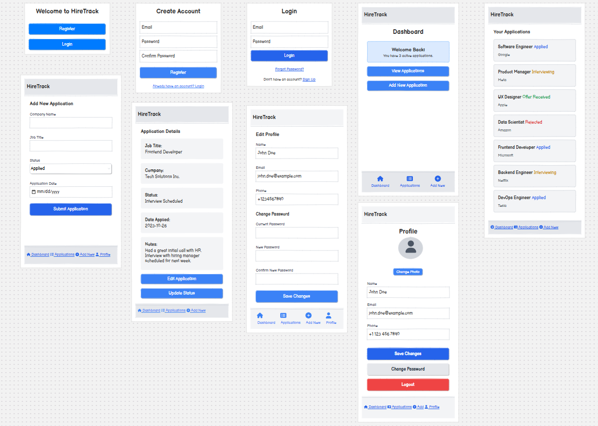

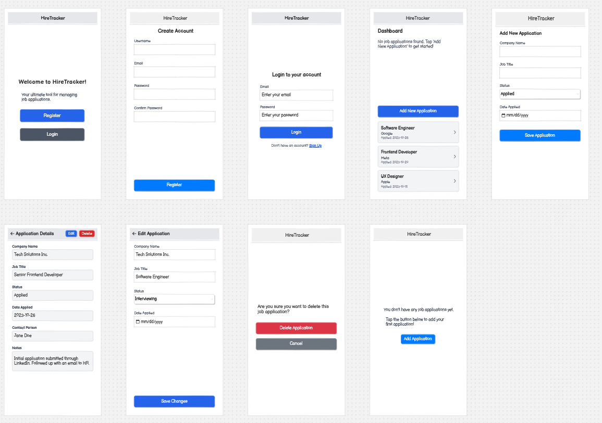

## Wireframes

The initial wireframes for HireTrack were created in Balsamiq during the
planning stage of the project. Their purpose was to establish the basic
structure, navigation and user journey before development began.

The final application differs from these original wireframes. During
development, the interface and functionality evolved as the project was
tested across different screen sizes and additional requirements were
implemented.

Some of the main changes from the original wireframes include:

- The original mobile-style bottom navigation was replaced with a responsive
  Bootstrap navigation bar that works across desktop, tablet and mobile
  devices.
- The original Dashboard and Applications concepts were developed into the
  final application dashboard, which provides application information,
  status summaries and filtering in one area.
- The original Profile concept evolved into Account Settings, focusing on
  account information, email and password management, and account deletion.
- The Add Application form was expanded as the data model developed to
  capture more useful information about each job application.
- Statistics functionality was introduced during development to give users
  an overview of their application progress.
- Role-based administration was added to support the HireTrack Admin
  functionality and was not part of the initial wireframes.

These differences demonstrate the development of the project from the
initial design concept to the final implementation. The wireframes were
used as a starting point rather than as a fixed specification.


## Mockups  
### Refined Design Mockups

Following the initial wireframing stage, more detailed mockups were created
in Figma to develop the visual direction of HireTrack.

The Figma designs introduced the colour scheme, typography, navigation,
cards, application tables and other interface elements that are much closer
to the final implementation, while retaining the core user
journey established during the initial planning stage.

#### Home Page Mockup

The refined home page mockup established the public-facing design, including
the HireTrack branding, feature overview, registration call-to-action and
step-by-step introduction to the application.
 Home page
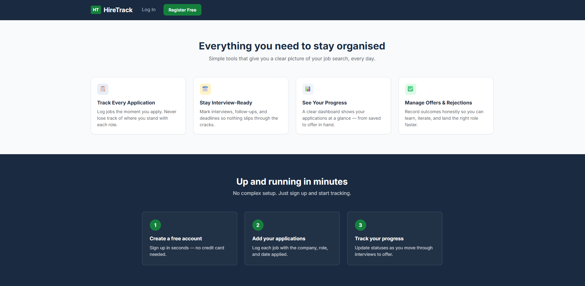    

#### Dashboard Mockup

The refined dashboard mockup introduced the application summary cards,
status filtering, application table and primary application management
actions used in the final interface.

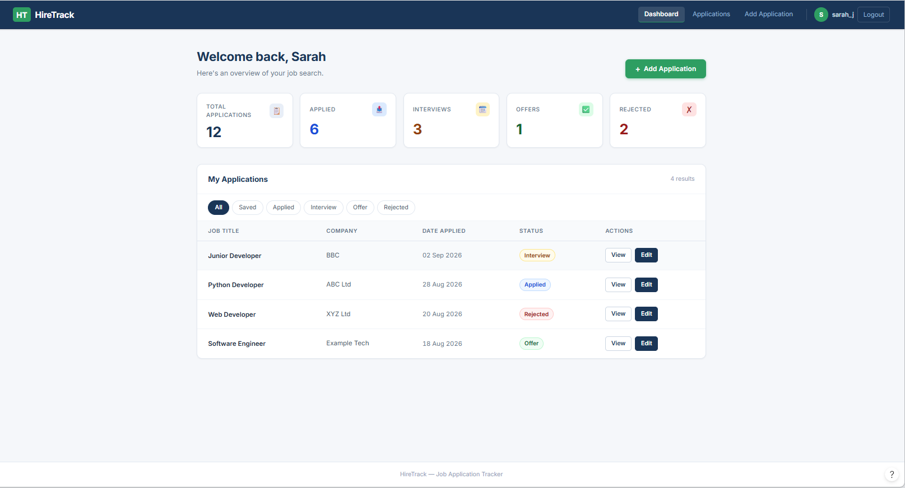
- Dashboard mockup  

#### Design Changes During Development

The final dashboard remained close to the refined mockup, with some changes
made during implementation to improve the presentation of information.

One change was the removal of the **Rejected** summary card from the top
section of the dashboard. The final design keeps the three progress-focused
cards — **Applied, Interviews and Offers** — alongside the **Total
Applications** summary.

Rejected applications are still fully supported and can be viewed and
filtered within the application list. Removing the Rejected card from the
summary area allowed the top of the dashboard to focus on positive progress
through the job application process while keeping rejection information
available when required.

### Design Rationale

HireTrack was designed to provide a clear and straightforward way for users
to manage their job applications without overwhelming them with information.

A dark navy and green colour scheme was chosen to give the application a
professional appearance while providing clear contrast for navigation,
buttons and important actions. Bootstrap components and a consistent card
layout were used throughout the application to maintain a familiar and
cohesive interface.

The dashboard was designed as the main focus for authenticated users. It
provides an immediate overview of application progress before presenting
the individual applications below. Status filtering allows users to quickly
find applications at different stages of their job search.

The final dashboard was refined from the Figma mockup. The Rejected summary
card was removed so that the three cards beside Total Applications focus on
progress through the application process: Applied, Interviews and Offers.
Rejected applications remain available through the application list and
status filters.

Responsive design was also an important consideration. Layouts were adapted
for desktop, tablet and mobile devices so that application information and
actions remain accessible at different screen sizes.

The design developed from initial low-fidelity Balsamiq wireframes into
higher-fidelity Figma mockups and finally the implemented Django
application. Changes made during development were based on usability,
responsive behaviour and the functionality introduced as the project
developed.

### Typography
HireTrack uses **Inter** for readability and professional appearance.

### Colour Palette
- Navy `#1a3557` — navigation, headings, buttons  
- Dark navy `#15294a` — borders  
- Green `#2e9e62` — primary CTA  
- Background `#f5f7fa`  
- White `#ffffff`

### Status Colours
| Status     | Background | Text | Border |
|------------|------------|------|--------|
| Saved      | #f0f4ff    | #3b4fa8 | #c7d2fe |
| Applied    | #eff6ff    | #1d4ed8 | #bfdbfe |
| Interview  | #fffbeb    | #92400e | #fde68a |
| Offer      | #f0fdf4    | #166534 | #bbf7d0 |
| Rejected   | #fef2f2    | #991b1b | #fecaca |

### Spacing & Layout
Generous whitespace, consistent spacing, and card-based grouping improve readability.

### Navigation
Clear navigation with active page highlighting.

## Responsive Design
HireTrack adapts across desktop, tablet, and mobile using Flexbox, Grid, and media queries.

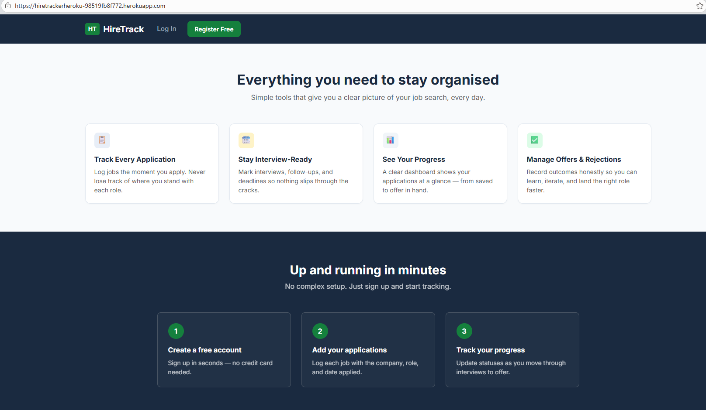
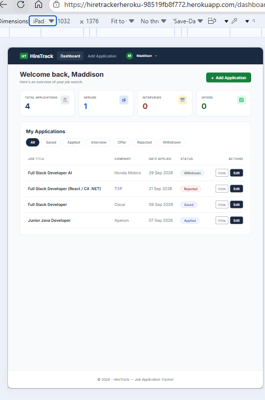
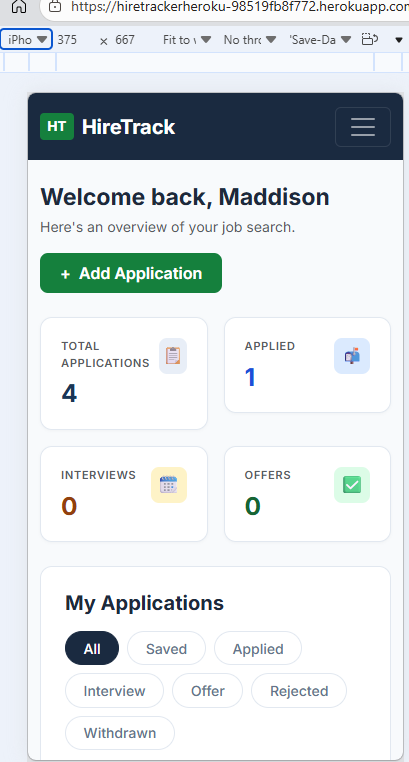


## Accessibility
HireTrack was developed with accessibility and WCAG best practices in mind.

- Semantic HTML  
- Logical heading hierarchy  
- Labelled forms  
- Colour contrast  
- Keyboard navigation  
- Visible focus states  
- Alt text  
- Status communicated via colour + text  

Accessibility testing is documented in TESTING.md.

---

# Agile Development

HireTrack was developed using Agile methodology, with GitHub Projects used
to organise and track the development of the application.

The project began with five core user stories covering registration, login,
authorisation, adding job applications and tracking job applications. As
development progressed, additional requirements and functionality were
identified and incorporated into the project.

## GitHub Project Board

The GitHub Project board was used to track user stories and development
tasks throughout the project.

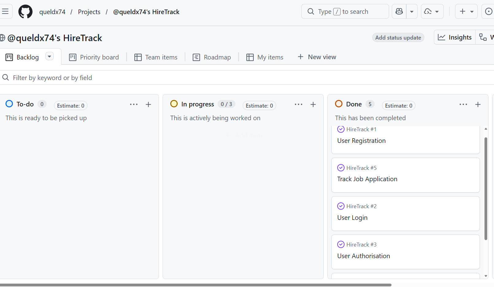


## Workflow

Project items were tracked through the following stages:

- **To-do** - Work ready to be started.
- **In Progress** - Functionality currently being developed.
- **Done** - Completed functionality.
- **Backlog** - Requirements or ideas not currently being worked on.

## MoSCoW Prioritisation

MoSCoW prioritisation was used to classify requirements according to their
importance to the current release of HireTrack.

### Must Have

- User registration
- Login and logout
- User authorisation
- User-specific application data
- Create job applications
- View job applications
- Edit job applications
- Delete job applications
- Responsive interface

### Should Have

- Application status tracking
- Filtering applications by status
- Application statistics
- Account settings
- Password management

### Could Have

- HireTrack Admin Dashboard
- Admin user management
- Additional application analytics
- Application search

### Won't Have (This Release)

The following features were identified as possible future developments but
were outside the scope of the current release:

- Email reminders and notifications
- CV/document uploads
- Job board/API integration
- More advanced analytics

---

# Features

## User Registration
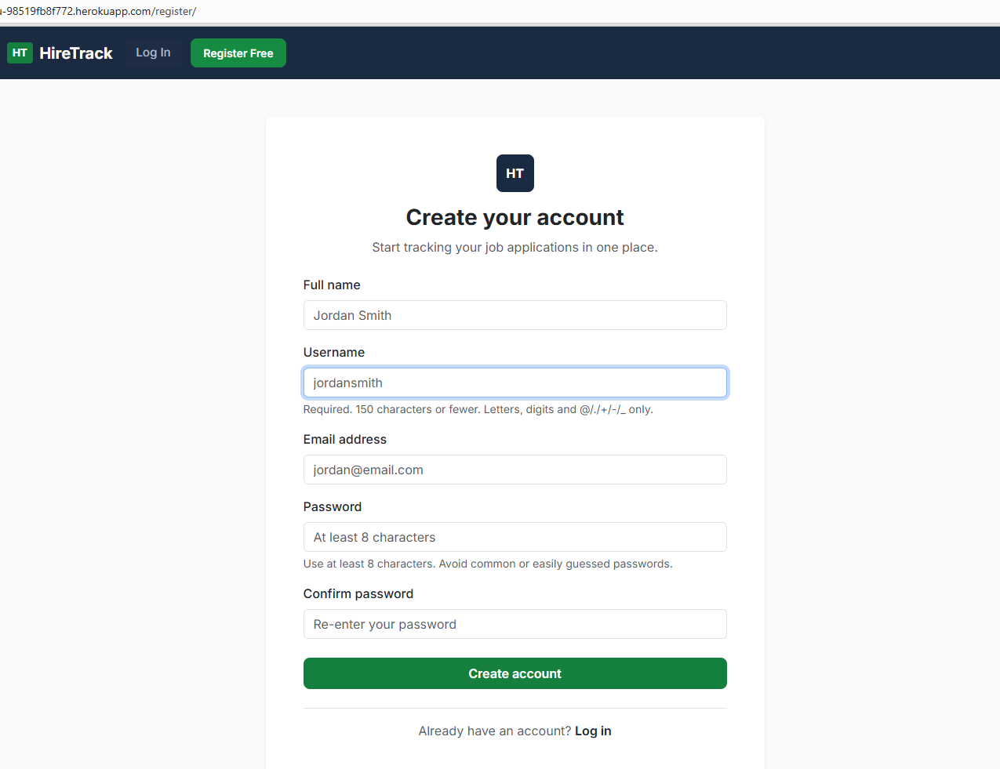
User registration allows new users to create an account by providing a username, email address, and password. The registration form includes validation to ensure that all required fields are completed and that the email address is in a valid format. Upon successful registration, users are redirected to the login page to access their new account.


## Login and Logout
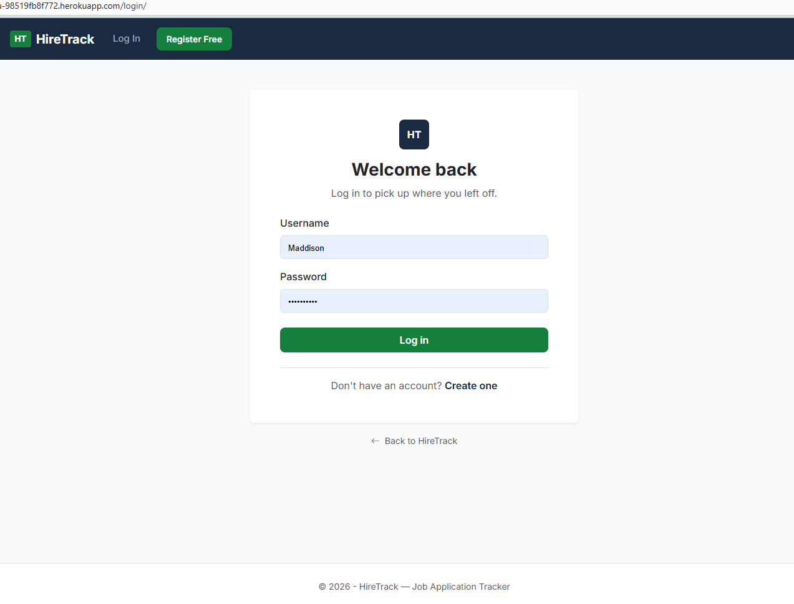
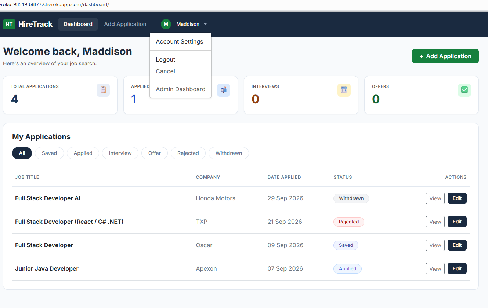
Login functionality allows registered users to securely access their accounts using their email and password. The login form includes validation to ensure that the provided credentials are correct. Upon successful login, users are redirected to their dashboard, where they can manage their job applications. Logout functionality is in the dropdown menu of the user profile, allowing users to securely end their session and return to the public-facing home page.

## Dashboard
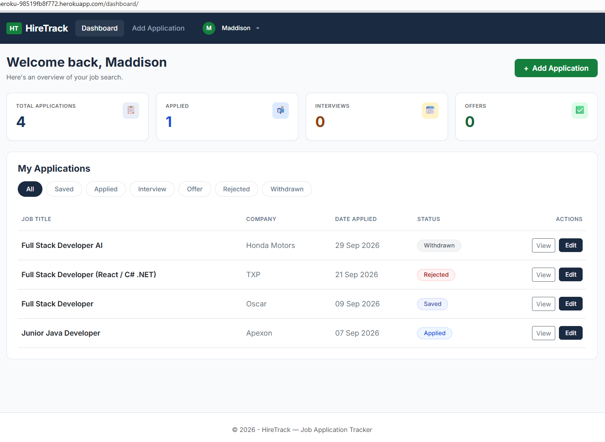
Dashboard functionality provides users with an overview of their job applications, including summary cards for total applications, applications in progress, interviews, and offers. The dashboard also includes a table listing all job applications, with options to view, edit, or delete each application. Users can filter applications by status to quickly find specific records.

## Create Application

Creating a new job application allows users to input relevant details such as job title, company, location, date applied, status, job URL, salary, and notes. The form includes validation to ensure that all required fields are completed and that the data is in the correct format. Upon successful submission, the new application is added to the user's list of applications and a confirmation message is displayed.


## Applications Details
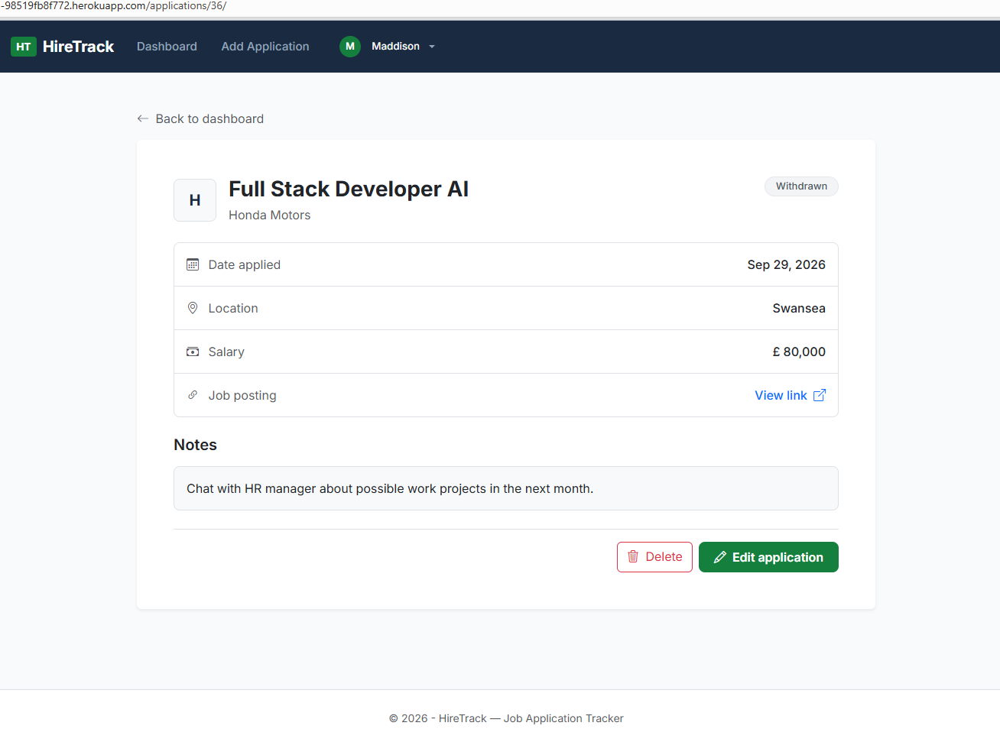
All job applications are displayed in a table format, allowing users to quickly scan through their records. Each application entry includes key details such as job title, company, location, date applied, and status. Users can click on an individual application to view more detailed information.

## Edit Application
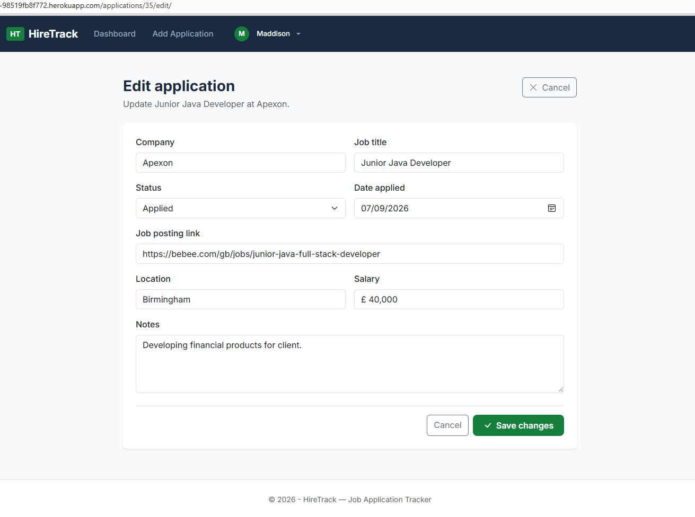
Users can edit existing job applications by clicking the edit button next to each application in the table. The edit form allows users to update any of the application details, including job title, company, location, date applied, status, job URL, salary, and notes. The form includes validation to ensure that all required fields are completed and that the data is in the correct format. Upon successful submission, the updated application is saved and a confirmation message is displayed.


## Delete Application
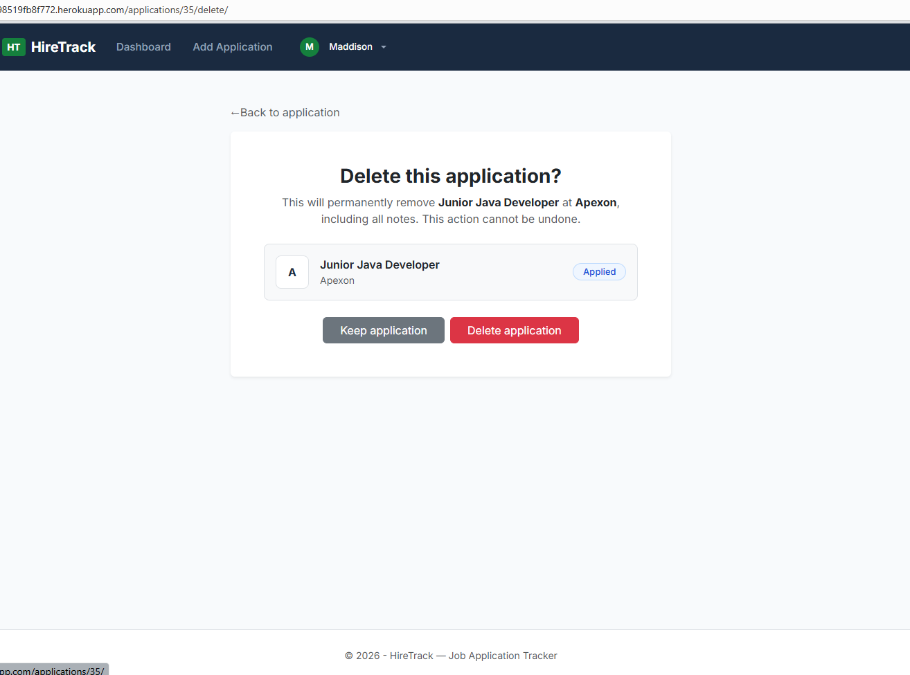
Users can delete existing job applications by clicking the delete button next to each application in the table. A confirmation dialog will appear to ensure that the user wants to proceed with the deletion. Upon successful deletion, the application is removed from the user's list of applications and a confirmation message is displayed.

## Status Filtering
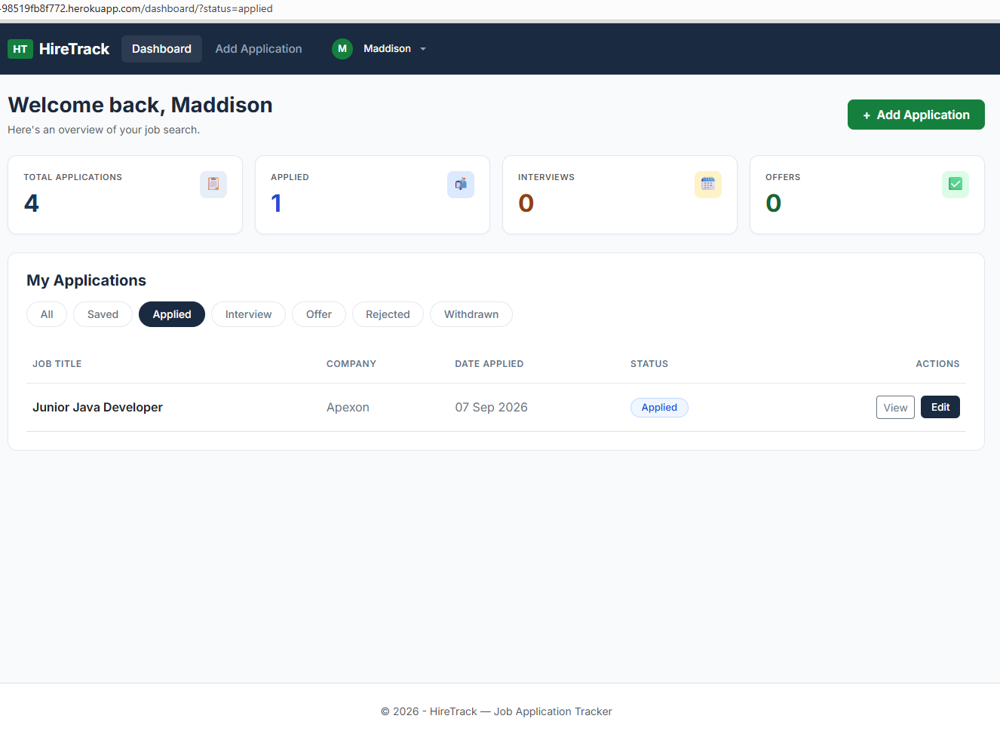
Users can filter their job applications by status using a dropdown menu on the dashboard. This allows users to quickly view applications that are in progress, have been interviewed, received offers, or have been rejected. The filtered results are displayed in the application table, making it easy for users to manage their job search effectively.


## Account Settings
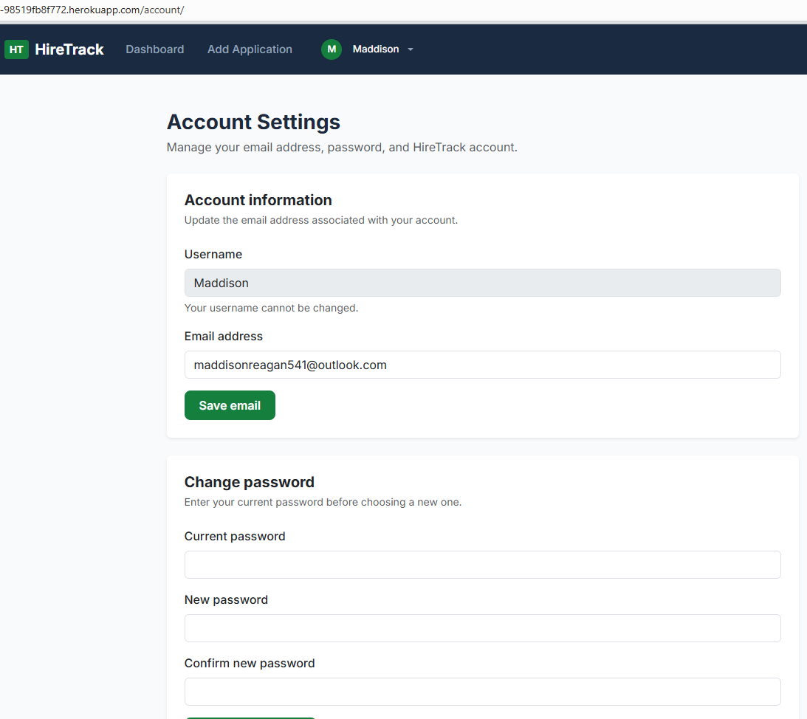
Account settings allow users to manage their account information, including updating their email address and password. Users can also delete their account if they wish to do so. The account settings page includes validation to ensure that all required fields are completed and that the data is in the correct format. Upon successful submission, the updated account information is saved and a confirmation message is displayed.

## HireTrack Admin Dashboard
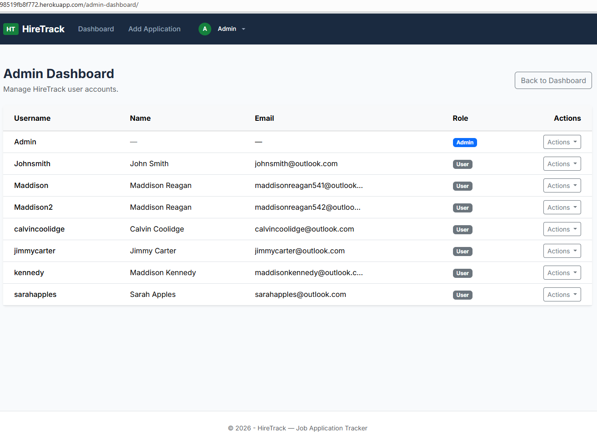
The HireTrack Admin Dashboard provides administrative users with an overview of all registered users and their job applications. Admin users can view, edit, and delete user accounts and applications, as well as manage user permissions. The admin dashboard includes summary cards for total users, total applications, and other relevant statistics. Access to the admin dashboard is restricted to users with administrative privileges.


## User Feedback
  
Django messages provide users with confirmation and feedback following
important actions.

### User Registration  
### Login & Logout  
### Dashboard  
### Create Application  
### View Applications  
### Application Details  
### Edit Application  
### Delete Application  
### Status Filtering  
### User Feedback (messages)

---

# Data Model

HireTrack uses Django's built-in `User` model for authentication and a
custom `JobApplication` model for storing and managing each user's job
applications.

## ERD Diagram
The Entity Relationship Diagram (ERD) for HireTrack was created using
dbdiagram.io. It illustrates the database structure and the one-to-many
relationship between Django's built-in `User` model and the custom
`JobApplication` model.
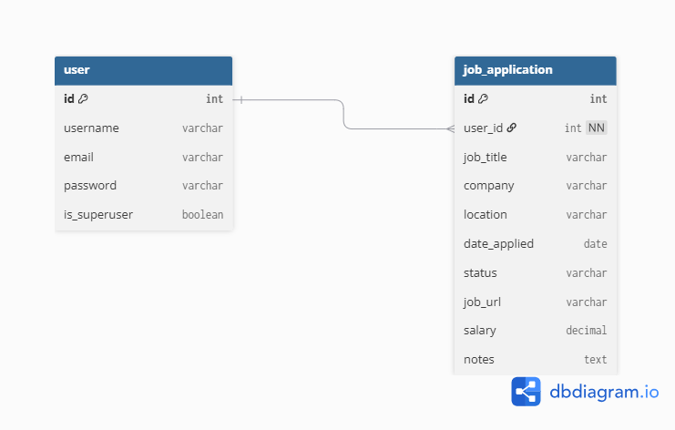 


### User

HireTrack uses Django's built-in `User` model. Key fields relevant to the
application include:

- `id`
- `username`
- `email`
- `password`
- `is_staff`
- `is_superuser`

### JobApplication

The custom `JobApplication` model contains:

- `id` - automatically generated primary key
- `user_id` - foreign key linking the application to its owner
- `job_title` - required, maximum 50 characters
- `company` - required, maximum 50 characters
- `location` - optional, maximum 100 characters
- `date_applied` - date the application was made
- `status` - current stage of the application
- `job_url` - optional link to the job posting
- `salary` - optional salary information
- `notes` - optional additional notes

The available application statuses are `Saved`, `Applied`, `Interview`,
`Offer`, `Rejected` and `Withdrawn`. New applications use `Saved` as the
default status.

### Relationship

A **User** can have **many JobApplications**, while each JobApplication
belongs to exactly one User.

This is implemented using a Django `ForeignKey` with
`on_delete=models.CASCADE`. If a user account is deleted, the job
applications associated with that account are also deleted.

# CRUD Functionality

| Operation | HireTrack Functionality |
|----------|--------------------------|
| Create   | Add new job application |
| Read     | View list + details |
| Update   | Edit application |
| Delete   | Delete with confirmation |

Access controls ensure users can only modify their own records.

---

# Authentication and Authorization

HireTrack uses Django authentication.

Documented features:

- Registration  
- Login  
- Logout  
- Login state reflection  
- Protected pages  
- User-specific data  
- Admin access via custom-build database
- Permission checks preventing cross-user access  

---
### Form Validation

HireTrack uses Django form and model validation to validate user input.

- Required fields must be completed before a form can be submitted successfully.
- Date input is handled using Django's `DateField` and an HTML date input.
- Application status is restricted to the predefined status choices.
- URL input is validated using Django's `URLField`.
- Validation errors are displayed to the user when submitted data is invalid.
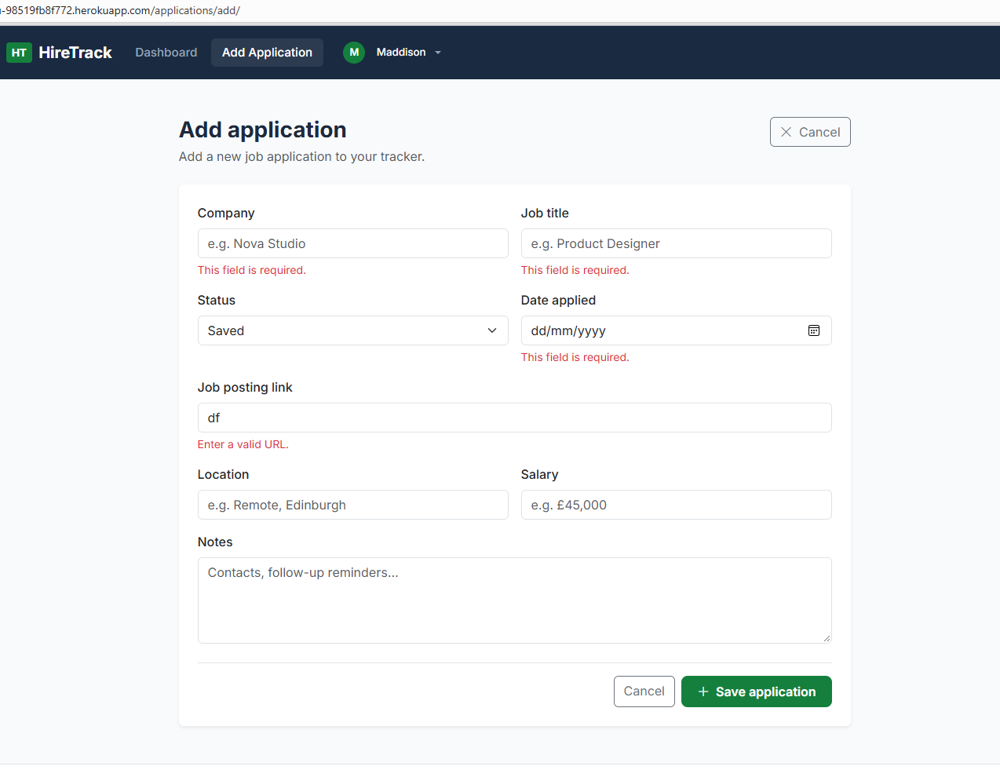


---

# User Feedback and Notifications

HireTrack uses Django’s messages framework.

| Test | Expected Result | Result |
| --- | --- | --- |
| Application created | Valid application is saved and success feedback is displayed | ✅ Pass |
| Application updated | Changes are saved and success feedback is displayed | ✅ Pass |
| Application deleted | Application is removed and success feedback is displayed | ✅ Pass |
| Invalid form submission | Validation errors are displayed and invalid data is not saved | ✅ Pass |
| Unauthorised access | User is prevented from accessing data or pages they do not have permission to access | ✅ Pass |

Evidence of user feedback and notifications is provided in the following screenshots:
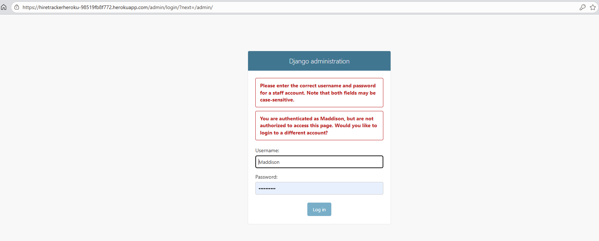
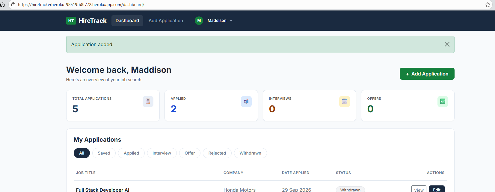

---
## Business Logic

Custom application logic includes:

- Filtering job applications so users can only access their own data
- Filtering applications by their current status
- Calculating dashboard and application statistics
- Automatically associating newly created job applications with the logged-in user
- Validating account changes, including email and password updates
- Using cascade deletion so applications associated with a deleted user are also removed
- Role-based access control separating regular users, HireTrack Admins and Django superusers
- Regular users cannot access administrative areas
- HireTrack Admins can access the custom HireTrack Admin Dashboard but cannot access Django's built-in Admin interface
- Django's built-in Admin interface is restricted to superusers
- Superusers are excluded from the custom HireTrack Admin Dashboard
- HireTrack Admins cannot view or delete other administrator accounts
---

# Technologies Used

### Languages

- Python
- HTML5
- CSS3

### Frameworks and Libraries

- Django - backend framework, authentication, forms, ORM and application logic
- Bootstrap - responsive layout and user interface components
- Bootstrap Icons - icons used throughout the user interface

### Database

- PostgreSQL - relational database used by HireTrack
- Neon - cloud-hosted PostgreSQL database service

### Deployment

- Heroku - deployment and hosting of the production application
- Neon - cloud-hosted PostgreSQL database used by the deployed application

### Design Tools

- Balsamiq - initial low-fidelity wireframes
- Figma - refined high-fidelity interface mockups
- dbdiagram.io - Entity Relationship Diagram (ERD)

### Development and Version Control

- Visual Studio Code - development environment
- Git - version control
- GitHub - source code repository
- GitHub Projects - Agile planning and user story tracking

### Testing and Validation

- Flake8 - Python code quality and PEP8 checking
- Black - consistent Python code formatting
- Code Institute Python Linter - final Python validation
- W3C Markup Validation Service - HTML validation
- W3C CSS Validation Service - CSS validation
- Django Test Framework - automated application testing
- Chrome DevTools - responsive and browser testing
- Google Lighthouse - performance, accessibility, best practices and SEO testing

### Deployment
- # Deployment

HireTrack is deployed using **Heroku**, with the source code hosted on
GitHub and the production PostgreSQL database hosted by Neon.

The Heroku application is connected directly to the GitHub repository,
allowing the application to be deployed from the project's GitHub codebase.

The production architecture consists of:

- **GitHub** - source code and version control
- **Heroku** - application hosting and deployment
- **Gunicorn** - production WSGI server
- **Django** - web application framework
- **WhiteNoise** - static file serving
- **Neon** - cloud-hosted PostgreSQL database

## Preparing the Application for Deployment

Before deployment, the project dependencies were recorded in
`requirements.txt` so that Heroku could install the packages required by
the application.

Sensitive configuration values are stored using environment variables
rather than being hard-coded into the repository.

The application uses a `Procfile` to tell Heroku how to start the Django
application:

```text
web: gunicorn hiretrack.wsgi

This starts HireTrack using Gunicorn and the project's WSGI configuration.
Heroku Application
A Heroku application was created for HireTrack and connected directly to
the project's GitHub repository.
The deployment process was:
1. Create the HireTrack application in Heroku.
2. Connect the Heroku application to the HireTrack GitHub repository.
3. Configure the required environment variables in Heroku.
4. Connect the application to the Neon PostgreSQL database.
5. Deploy the selected GitHub branch through Heroku.
6. Apply the Django database migrations.
7. Test the deployed application using the live Heroku URL.
When new changes are committed and pushed to GitHub, the updated version
can be deployed to Heroku from the connected repository.
Environment Variables
Sensitive information is stored as Heroku Config Vars rather than being
committed to GitHub.
The production configuration requires values including:
- SECRET_KEY - Django's secret key
- DATABASE_URL - connection string for the Neon PostgreSQL database
The application retrieves these values from the environment:
SECRET_KEY = os.environ.get("SECRET_KEY")


The database configuration uses dj-database-url:
DATABASES = {    "default": dj_database_url.parse(os.environ.get("DATABASE_URL"))}


This allows the same Django project to connect securely to the PostgreSQL
database without exposing database credentials in the source code.
Neon PostgreSQL Database
HireTrack uses a PostgreSQL database hosted by Neon.
The Neon database connection string is stored in the DATABASE_URL
environment variable. Django reads this value through dj-database-url
when establishing the database connection.
Database migrations are used to create and update the production database
schema.
When required, migrations are applied using:
python manage.py migrate

No database credentials are committed to the GitHub repository.
Static Files and WhiteNoise
HireTrack uses WhiteNoise to serve static files in the deployed
environment.
WhiteNoise is included in the Django middleware configuration immediately
after Django's security middleware:
MIDDLEWARE = [    "django.middleware.security.SecurityMiddleware",    "whitenoise.middleware.WhiteNoiseMiddleware",    ...]


The static file configuration is:
STATIC_URL = "/static/"STATICFILES_DIRS = [os.path.join(BASE_DIR, "static")]STATIC_ROOT = os.path.join(BASE_DIR, "staticfiles")


The source static files are stored in the project's static directory.
Django's collectstatic process collects these files into staticfiles
for the production environment.
Static files can be collected manually using:
python manage.py collectstatic

This allows the custom HireTrack CSS to be served correctly by WhiteNoise
when the application is deployed.
Allowed Hosts
The production Heroku hostname is included in Django's ALLOWED_HOSTS
configuration alongside the local development hosts.
This allows the application to respond to requests from the deployed
Heroku domain while retaining support for local development.
Production Security
The production configuration uses environment variables to prevent
sensitive credentials from being stored in the source code.
Important production security measures include:
- SECRET_KEY is stored as an environment variable.
- DATABASE_URL is stored securely outside the GitHub repository.
- Database credentials are not hard-coded into the project.
- DEBUG is disabled in production.
- Django CSRF protection is enabled.
- Authentication is required for protected functionality.
- Job applications are restricted to their authenticated owner.
- Regular users cannot access administrative functionality.
- HireTrack Admins use the custom Admin Dashboard and cannot access
  Django's built-in Admin interface.
- Django's built-in Admin interface is restricted to superusers.
Deploying Updates
Changes are developed locally and committed using Git:
git add .
git commit -m "Commit message"
git push

The commits are pushed to the GitHub repository connected to the Heroku
application.
The updated GitHub code can then be deployed through Heroku.
If changes to Django models have been made, migrations should first be
created and committed:
python manage.py makemigrations
python manage.py migrate

The required migrations can then be applied to the production database
after deployment.
Deployment Testing
After deployment, the live Heroku application was tested to confirm that:
- The home page loads correctly.
- Static CSS and Bootstrap assets load correctly.
- Users can register, log in and log out.
- Authenticated users can create, view, edit and delete applications.
- Application data persists in the Neon PostgreSQL database.
- Users cannot access another user's application data.
- Application status filtering works correctly.
- Dashboard statistics display correctly.
- Account settings function correctly.
- Role-based permissions function correctly.
- The HireTrack Admin Dashboard is restricted to HireTrack Admin users.
- Django Admin is restricted to superusers.
- Custom error pages display correctly.
- The application remains usable across desktop, tablet and mobile screen
  sizes.
Local Deployment
To run HireTrack locally, clone the repository and navigate to the project
directory:
git clone <repository-url>
cd HireTrack

Create and activate a Python virtual environment:
python -m venv .venv
source .venv/bin/activate

On Windows Command Prompt, the virtual environment can instead be activated
using:
.venv\Scripts\activate

Install the project dependencies:
pip install -r requirements.txt

Configure the required environment variables, including SECRET_KEY and
DATABASE_URL.
Apply the database migrations:
python manage.py migrate

Start the Django development server:
python manage.py runserver

The application can then be accessed through the local address displayed
by Django.
Anyone running their own copy of HireTrack must provide their own
environment variables and database credentials. Production secrets are not
included in the GitHub repository.

# Testing Summary

Full testing documentation is in **TESTING.md**.

Summary:

- Manual functional testing  
- Authentication testing  
- CRUD testing  
- Permission testing  
- Form validation testing  
- User story testing  
- Automated Django tests  
- Responsive testing  
- Browser testing  
- Accessibility testing  
- HTML validation  
- CSS validation  
- Python validation  
- Bug documentation  

---

# Security

HireTrack implements:

- Environment variables for sensitive settings  
- SECRET_KEY not committed  
- `.gitignore` for local files  
- DEBUG=False in production  
- Allowed hosts configured  
- CSRF protection  
- User-specific access controls  
- Django password hashing  

---

# Deployment

## Local Development

Clone repository:
```bash
git clone https://github.com/queldx74/HireTrack


## Forking and Cloning the Repository

Developers who wish to work with their own copy of HireTrack can either
**fork** the repository on GitHub or **clone** it directly to their local
machine.

### Forking the Repository

Forking creates a copy of the HireTrack repository within your own GitHub
account. This allows you to make changes without affecting the original
repository.

To fork the repository:

1. Log in to GitHub.
2. Navigate to the HireTrack GitHub repository.
3. Click the **Fork** button in the top-right corner of the repository page.
4. Select the GitHub account where the fork should be created.
5. GitHub will create a copy of the repository under the selected account.
6. The fork can then be cloned to a local machine for development.

Changes made to the fork are independent of the original HireTrack
repository unless a pull request is created.

### Cloning the Repository

Cloning creates a local copy of the repository on your computer.

To clone HireTrack:

1. Navigate to the HireTrack repository on GitHub.
2. Click the green **Code** button.
3. Select **HTTPS**.
4. Copy the repository URL.
5. Open a terminal in the directory where the project should be stored.
6. Run:

```bash
git clone <repository-url>
```

For a forked repository, use the URL of your own fork instead.

Once cloning has completed, navigate into the project directory:

```bash
cd HireTrack
```

The project files will now be available locally.

---

## Running HireTrack Locally

### 1. Create a Virtual Environment

It is recommended to use a Python virtual environment so that the project's
dependencies remain separate from other Python projects installed on the
computer.

Create a virtual environment from the project directory:

```bash
python -m venv .venv
```

### 2. Activate the Virtual Environment

On macOS or Linux:

```bash
source .venv/bin/activate
```

On Windows Command Prompt:

```text
.venv\Scripts\activate
```

On Windows PowerShell:

```powershell
.venv\Scripts\Activate.ps1
```

Once activated, the virtual environment name should appear in the terminal.

---

### 3. Install Project Dependencies

HireTrack's Python dependencies are recorded in `requirements.txt`.

Install them using:

```bash
pip install -r requirements.txt
```

This installs Django and the other Python packages required by the
application, including the packages used for the PostgreSQL database,
Gunicorn and WhiteNoise.

---

### 4. Create a PostgreSQL Database

HireTrack uses PostgreSQL and requires a valid database connection.

A developer running their own copy of the project must provide their own
PostgreSQL database.

One option is to create a PostgreSQL database using Neon:

1. Create or log in to a Neon account.
2. Create a new PostgreSQL project/database.
3. Obtain the database connection string supplied by Neon.
4. Keep the connection string private.
5. Add the connection string to the local environment configuration as
   `DATABASE_URL`.

The production database credentials used by the original HireTrack
application are not included in the GitHub repository.

---

### 5. Configure Environment Variables

HireTrack retrieves sensitive configuration from environment variables.

The following values are required:

| Variable | Purpose |
| --- | --- |
| `SECRET_KEY` | Django secret key used for cryptographic signing |
| `DATABASE_URL` | PostgreSQL database connection string |
| `DEBUG` | Controls Django debug mode during development |

The Django settings retrieve the secret key using:

```python
SECRET_KEY = os.environ.get("SECRET_KEY")
```

The database connection is configured using:

```python
DATABASES = {
    "default": dj_database_url.parse(os.environ.get("DATABASE_URL"))
}
```

A local development environment therefore needs its own values for
`SECRET_KEY` and `DATABASE_URL`.

If using the project's local `env.py` approach, create an `env.py` file in
the project root.

For example:

```python
import os

os.environ.setdefault("SECRET_KEY", "your-secret-key")
os.environ.setdefault("DATABASE_URL", "your-postgresql-database-url")
os.environ.setdefault("DEBUG", "True")
```

Replace the example values with your own credentials.

The `env.py` file contains sensitive information and **must not be committed
to GitHub**. Ensure that it is included in `.gitignore`.

> Never copy the original HireTrack production `SECRET_KEY` or Neon database
> credentials into a public repository.

---

### 6. Apply Database Migrations

Once the database connection has been configured, apply the Django
migrations:

```bash
python manage.py migrate
```

This creates the required database tables in the configured PostgreSQL
database.

If the command completes successfully, the local application is connected
to the database and its schema is ready for use.

---

### 7. Create a Superuser (Optional)

A local superuser can be created if access to Django's built-in Admin
interface is required:

```bash
python manage.py createsuperuser
```

Django will prompt for the required account details.

In HireTrack, Django's built-in Admin interface is reserved for superusers.
This is separate from the custom HireTrack Admin Dashboard used by
HireTrack Admin accounts.

---

### 8. Collect Static Files

For normal local development with Django debug mode enabled, Django can
serve development static files.

Static files can also be collected using:

```bash
python manage.py collectstatic
```

The project's source static files are stored in `static`, while collected
production static files are placed in `staticfiles`.

HireTrack uses WhiteNoise to serve collected static files in the deployed
production environment.

---

### 9. Check the Django Configuration

Before starting the application, Django's system checks can be run using:

```bash
python manage.py check
```

A successful result should report that no system check issues were
identified.

---

### 10. Start the Development Server

Start the local Django development server using:

```bash
python manage.py runserver
```

Django will display the local development address in the terminal,
typically:

```text
http://127.0.0.1:8000/
```

Open this address in a web browser to use HireTrack locally.

The development server can be stopped by pressing `Ctrl + C` in the
terminal.

---

## Local Development Workflow

After the application has been configured, a typical development workflow
is:

```bash
git pull
python manage.py migrate
python manage.py runserver
```

After making changes, they can be committed using:

```bash
git add .
git commit -m "Describe the changes made"
git push
```

If working from a fork, these commits are pushed to the developer's own
forked repository.

---

## Database Model Changes

If changes are made to Django models, create new migrations using:

```bash
python manage.py makemigrations
```

Apply them using:

```bash
python manage.py migrate
```

Migration files should be committed to version control so that the database
structure can be reproduced when the project is installed elsewhere.

---

## Running Automated Tests Locally

HireTrack's automated Django tests can be run using:

```bash
python manage.py test
```

When using the PostgreSQL/Neon configuration, the project may retain the
test database to avoid PostgreSQL connection issues during test database
cleanup.

The tests can therefore also be run using:

```bash
python manage.py test --keepdb
```

Django uses a separate test database for automated tests rather than the
normal application data.

---

## Local Installation Summary

To run HireTrack locally, a developer must therefore:

1. Fork or clone the GitHub repository.
2. Create and activate a Python virtual environment.
3. Install the dependencies from `requirements.txt`.
4. Create or provide a PostgreSQL database.
5. Configure `SECRET_KEY`, `DATABASE_URL` and the local `DEBUG` setting.
6. Apply Django migrations.
7. Optionally create a local superuser.
8. Run Django's system checks.
9. Start the Django development server.
10. Open the local application in a web browser.

Production credentials, including the original HireTrack `SECRET_KEY` and
Neon database credentials, are intentionally excluded from the repository.


# Credits

## Code and Technologies

- [Django](https://www.djangoproject.com/) - used as the main web framework for the HireTrack application.
- [Bootstrap](https://getbootstrap.com/) - used for responsive layouts, styling and interface components.
- [Bootstrap Icons](https://icons.getbootstrap.com/) - used for icons throughout the application.
- [WhiteNoise](https://whitenoise.readthedocs.io/) - used to serve static files in the deployed application.
- [Gunicorn](https://gunicorn.org/) - used as the production WSGI server.
- [Neon](https://neon.tech/) - used to host the PostgreSQL database.
- [Heroku](https://www.heroku.com/) - used to deploy and host the production application.
- [GitHub](https://github.com/) - used for version control, repository hosting and project management.

## Design

- [Balsamiq](https://balsamiq.com/) - used to create the initial low-fidelity wireframes.
- [Figma](https://www.figma.com/) - used to create refined high-fidelity interface mockups.
- [dbdiagram.io](https://dbdiagram.io/) - used to create the Entity Relationship Diagram (ERD).

## Testing and Validation

- [W3C Markup Validation Service](https://validator.w3.org/) - used to validate rendered HTML.
- [W3C CSS Validation Service](https://jigsaw.w3.org/css-validator/) - used to validate the project's custom CSS.
- [Flake8](https://flake8.pycqa.org/) - used for Python code quality and PEP8 checking.
- [Black](https://black.readthedocs.io/) - used to format Python code consistently.
- Code Institute Python Linter - used as an additional Python validation tool.
- Google Chrome DevTools - used for responsive design and browser testing.
- Google Lighthouse - used to test performance, accessibility, best practices and SEO.

## Learning Resources

- [Django Documentation](https://docs.djangoproject.com/) - consulted for Django models, forms, authentication, views, database functionality and deployment configuration.
- [Bootstrap Documentation](https://getbootstrap.com/docs/) - consulted for responsive layouts and Bootstrap components.
- [MDN Web Docs](https://developer.mozilla.org/) - used as a reference for HTML and CSS development.

## AI Assistance

AI tools were used during the development of HireTrack as a supporting resource for debugging, code review, documentation, testing guidance and explaining development concepts.

AI-generated suggestions were reviewed and adapted before being incorporated into the project. The final implementation, testing and project decisions remained the responsibility of the developer.

Further details about the use of AI during the project are documented in the project's AI reflection/testing section.

# Acknowledgements

I would like to thank:

- **Code Institute** for the course material, project guidance and resources that supported the development of this project.
- **Tutor Marko** for guidance, feedback and support throughout the development process.
- **Mentor Timor** for providing valuable feedback, advice and encouragement during the project.
- **Sarah** for career advice.
- The developers and maintainers of the open-source technologies and documentation used throughout HireTrack.