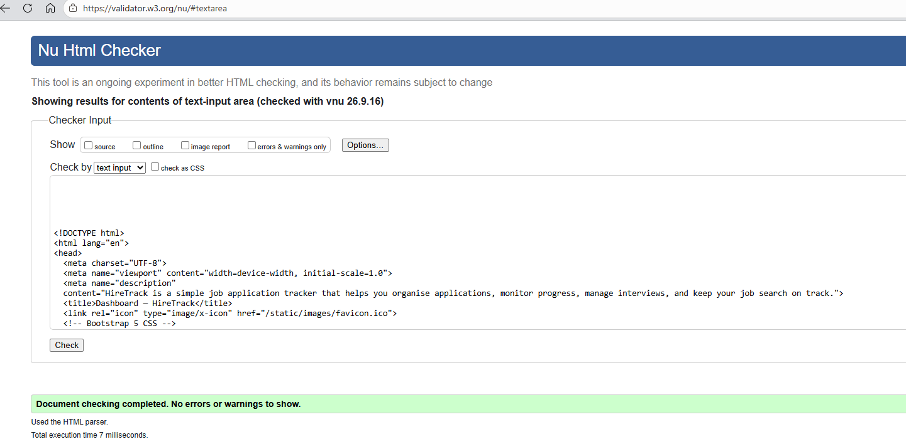
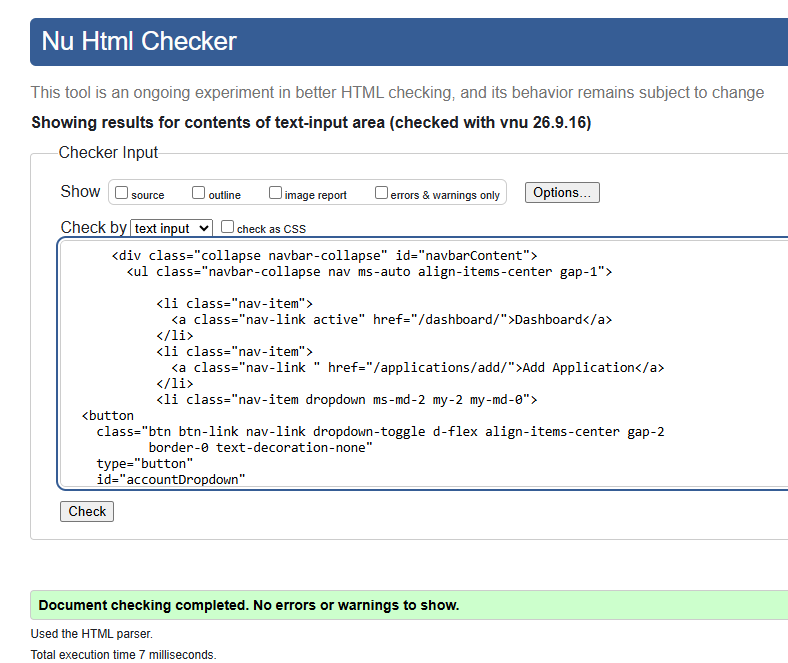
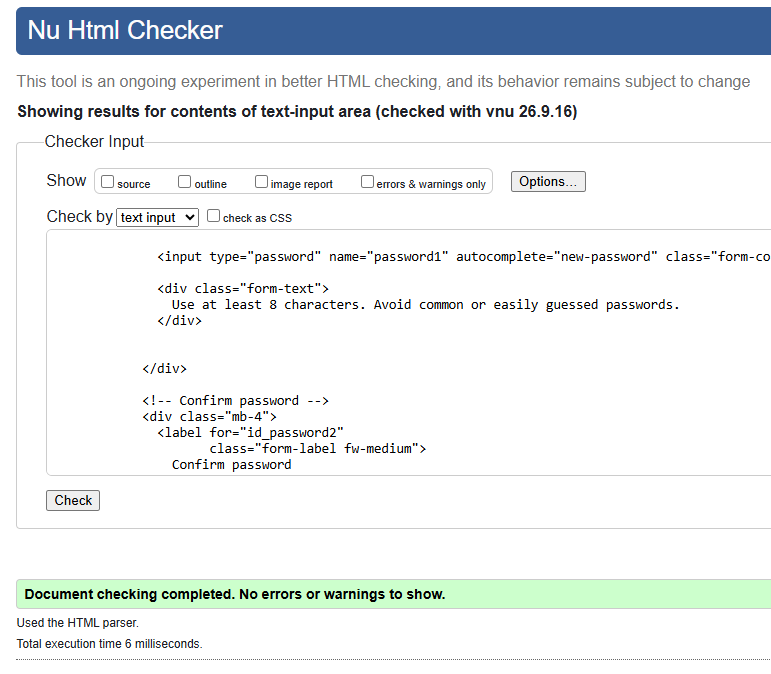
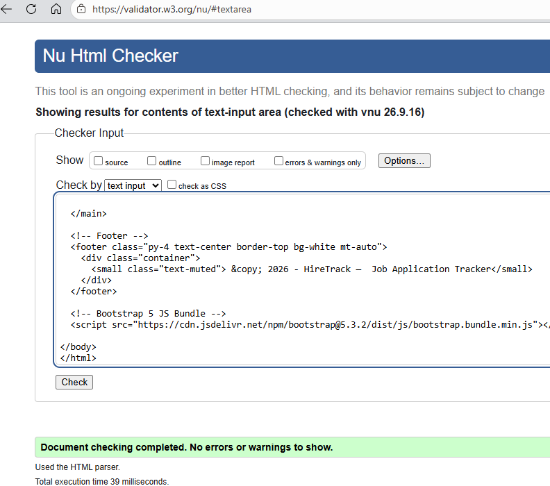
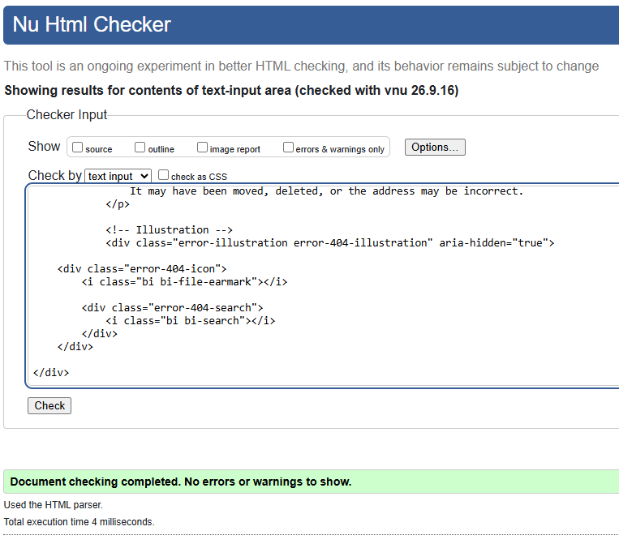
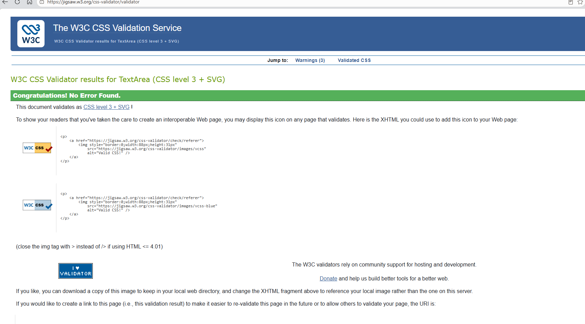

# HireTrack Testing

This document contains the testing procedures and results for **HireTrack**.

Testing was carried out throughout development to evaluate:

* Functionality
* CRUD operations
* Authentication
* Authorization
* Database behaviour
* Form validation
* Responsiveness
* Accessibility
* Usability
* Code quality

---

## Table of Contents

* [Testing Strategy](#testing-strategy)
* [Manual Functional Testing](#manual-functional-testing)
* [Authentication Testing](#authentication-testing)
* [CRUD Testing](#crud-testing)
* [Permission and Security Testing](#permission-and-security-testing)
* [Form Validation Testing](#form-validation-testing)
* [User Story Testing](#user-story-testing)
* [Automated Testing](#automated-testing)
* [Responsive Testing](#responsive-testing)
* [Browser Testing](#browser-testing)
* [Accessibility Testing](#accessibility-testing)
* [HTML Validation](#html-validation)
* [CSS Validation](#css-validation)
* [Python Validation](#python-validation)
* [JavaScript Testing](#javascript-testing)
* [Bugs](#bugs)
* [Final Testing Summary](#final-testing-summary)

---

# Testing Strategy

HireTrack was tested using a combination of manual and automated testing.

Testing focused particularly on:

* Ensuring users can securely register and log in.
* Ensuring authenticated users can manage job applications.
* Confirming CRUD operations modify database records correctly.
* Confirming users cannot access another user's records.
* Verifying form validation.
* Ensuring appropriate feedback is displayed.
* Testing responsive behaviour.
* Checking accessibility.
* Validating HTML, CSS, and Python code.

---

# Manual Functional Testing

## Navigation

| Test                  | Expected Result          | Actual Result | Pass/Fail |
| --------------------- | ------------------------ | ------------- | --------- |
| Open homepage         | Homepage loads correctly |               |           |
| Click Dashboard       | Dashboard loads          |               |           |
| Click Applications    | Application list loads   |               |           |
| Click Add Application | Form loads               |               |           |
| Click Logout          | User is logged out       |               |           |

---

# Authentication Testing

## Registration

| Test                                 | Expected Result            | Actual Result | Pass/Fail |
| ------------------------------------ | -------------------------- | ------------- | --------- |
| Register with valid information      | Account is created         |               |           |
| Register with missing required field | Validation error displayed |               |           |
| Register with duplicate username     | Validation error displayed |               |           |
| Enter mismatched passwords           | Validation error displayed |               |           |

## Login

| Test                           | Expected Result   | Actual Result | Pass/Fail |
| ------------------------------ | ----------------- | ------------- | --------- |
| Login with correct credentials | User is logged in |               |           |
| Login with incorrect password  | Error displayed   |               |           |
| Login with invalid username    | Error displayed   |               |           |
| Required username left blank   | Error displayed   |               |           |

## Logout

| Test                              | Expected Result          | Actual Result | Pass/Fail |
| --------------------------------- | ------------------------ | ------------- | --------- |
| Logged-in user selects Logout     | Session ends             |               |           |
| Visit protected page after logout | User redirected to login |               |           |

---

# CRUD Testing

## Create

| Test                                  | Expected Result            | Actual Result | Pass/Fail |
| ------------------------------------- | -------------------------- | ------------- | --------- |
| Submit valid application              | Application created        |               |           |
| Application belongs to logged-in user | Correct user stored        |               |           |
| Required field missing                | Validation error displayed |               |           |
| Successful creation                   | Success message displayed  |               |           |

## Read

| Test                      | Expected Result               | Actual Result | Pass/Fail |
| ------------------------- | ----------------------------- | ------------- | --------- |
| Open application list     | User's applications displayed |               |           |
| Open application detail   | Correct application displayed |               |           |
| User with no applications | Empty state displayed         |               |           |

## Update

| Test                      | Expected Result            | Actual Result | Pass/Fail |
| ------------------------- | -------------------------- | ------------- | --------- |
| Edit application          | Existing data displayed    |               |           |
| Save valid changes        | Database record updated    |               |           |
| Change application status | New status displayed       |               |           |
| Submit invalid data       | Validation error displayed |               |           |
| Successful update         | Success message displayed  |               |           |

## Delete

| Test                | Expected Result           | Actual Result | Pass/Fail |
| ------------------- | ------------------------- | ------------- | --------- |
| Select Delete       | Confirmation displayed    |               |           |
| Cancel deletion     | Application remains       |               |           |
| Confirm deletion    | Record removed            |               |           |
| Successful deletion | Success message displayed |               |           |

---

# Permission and Security Testing

One of HireTrack's key requirements is ensuring users can only access their own records.

Create at least two test accounts when manually testing this section.

| Test                                             | Expected Result       | Actual Result | Pass/Fail |
| ------------------------------------------------ | --------------------- | ------------- | --------- |
| User A views own application                     | Application displayed |               |           |
| User A attempts to view User B's application URL | Access denied / 404   |               |           |
| User A attempts to edit User B's application     | Access denied         |               |           |
| User A attempts to delete User B's application   | Access denied         |               |           |
| Logged-out user accesses dashboard               | Redirected to login   |               |           |
| Logged-out user accesses create page             | Redirected to login   |               |           |

---

# Form Validation Testing

## Job Application Form

| Field/Test              | Expected Result  | Actual Result | Pass/Fail |
| ----------------------- | ---------------- | ------------- | --------- |
| Job title missing       | Validation error |               |           |
| Company missing         | Validation error |               |           |
| Valid date              | Accepted         |               |           |
| Invalid date            | Validation error |               |           |
| Valid status            | Accepted         |               |           |
| Invalid/modified status | Rejected         |               |           |
| Optional notes empty    | Form accepted    |               |           |

Add tests for every custom validation rule implemented.

---

# User Story Testing

Use this section to demonstrate that completed functionality satisfies your planned user stories.

| ID   | User Story          | Expected Behaviour                    | Result | Pass/Fail |
| ---- | ------------------- | ------------------------------------- | ------ | --------- |
| US01 | Register account    | User can successfully register        |        |           |
| US02 | Login               | Registered user can log in            |        |           |
| US03 | Logout              | User can securely log out             |        |           |
| US04 | Create application  | Application can be created            |        |           |
| US05 | View applications   | User can see own applications         |        |           |
| US06 | View details        | Individual record can be viewed       |        |           |
| US07 | Edit application    | Record can be updated                 |        |           |
| US08 | Delete application  | Record can be deleted                 |        |           |
| US09 | Update status       | Status can be changed                 |        |           |
| US10 | Privacy             | Other users' records are inaccessible |        |           |
| US11 | Dashboard           | Summary data is displayed correctly   |        |           |
| US12 | Filter applications | Applications filter correctly         |        |           |

---

# Automated Testing

Django automated tests were used to test key application functionality.

Tests should cover areas such as:

* Models
* Forms
* Views
* Authentication
* Permissions
* CRUD functionality
* Status filtering

## Running Tests

```bash
python manage.py test
```

### Test Results

```text
Paste final test output here.
```

### Model Tests

Describe model tests implemented.

### Form Tests

Describe form validation tests.

### View Tests

Describe tests for pages and status codes.

### Authentication Tests

Describe login/authentication tests.

### Permission Tests

Describe tests that ensure users cannot access records belonging to another user.

### CRUD Tests

Describe create/read/update/delete automated tests.

### GitHub Copilot

Document how GitHub Copilot assisted with creating unit tests.

Explain:

* What tests Copilot suggested.
* What you changed.
* Why changes were necessary.
* What each final test verifies.

---

# Responsive Testing

HireTrack was designed and tested across desktop, tablet, and mobile layouts.

| Device / Width | Pages Tested | Result | Pass/Fail |
| -------------- | ------------ | ------ | --------- |
| Desktop        |              |        |           |
| Tablet         |              |        |           |
| Mobile         |              |        |           |

Test:

* Navigation
* Dashboard cards
* Application table/cards
* Forms
* Buttons
* Status badges
* Footer
* Text wrapping
* Horizontal overflow

---

# Browser Testing

| Browser | Device                     | Result | Pass/Fail |
| ------- | -------------------------- | ------ | --------- |
| Chrome  | Desktop                    |        |           |
| Firefox | Desktop                    |        |           |
| Edge    | Desktop                    |        |           |
| Safari  | Mobile/tablet if available |        |           |

Only list browsers you genuinely tested.

---

# Accessibility Testing

Document the accessibility tools and methods used.

Possible checks include:

* Colour contrast
* Heading hierarchy
* Form labels
* Keyboard navigation
* Focus visibility
* Link/button descriptions
* Image alternative text
* Status labels
* ARIA usage where necessary

## Accessibility Results

| Page               | Test/Tool | Result | Issues Fixed |
| ------------------ | --------- | ------ | ------------ |
| Homepage           |           |        |              |
| Dashboard          |           |        |              |
| Application Form   |           |        |              |
| Application Detail |           |        |              |

Add screenshots where useful.

---

# HTML Validation

HTML was tested using [insert validator/tool].

| Page                | Result | Errors | Resolution |
| ------------------- | ------ | ------ | ---------- |
| Homepage            |        |        |            |
| Dashboard           |        |        |            |
| Add Application     |        |        |            |
| Application Details |        |        |            |
| Edit Application    |        |        |            |

If an error was discovered, explain how it was corrected.


## HTML Validation

HTML validation was carried out using the W3C Markup Validation Service. As the project uses Django templates, each page was rendered in the browser and the generated HTML source was copied into the validator using Direct Input.

## HTML Validation

HTML validation was carried out using the W3C Markup Validation Service. As the project uses Django templates, each page was rendered in the browser and the generated HTML source was copied into the validator using Direct Input.

| Page | Template | Result |
| --- | --- | --- |
| Home | `application/home.html` | ✅ Pass / |
| Dashboard | `application/dashboard.html` | ✅ Pass / 
| Empty Dashboard | `application/empty-dashboard.html` | ✅ Pass /  
| Add Application | `application/add-application.html` | ✅ Pass / 
| Application Details | `application/application-details.html` | ✅ Pass /
| Edit Application | `application/edit-application.html` | ✅ Pass / 
| Delete Application | `application/delete-confirmation.html` | ✅ Pass |
| Statistics | `application/statistics.html` | ✅ Pass /
| Account Settings | `application/account-settings.html` | ✅ Pass  |
| Admin Dashboard | `application/admin-dashboard.html` | ✅ Pass |
| Admin User Details | `application/admin-user-detail.html` | ✅ Pass  |
| Admin Delete User | `application/admin-delete-user.html` | ✅ Pass  |
| Login | `registration/login.html` | ✅ Pass  |
| Registration | `registration/registration.html` | ✅ Pass  |
| 403 Error | `error/403.html` | ✅ Pass |
| 404 Error | `error/404.html` | ✅ Pass |
| 500 Error | `error/500.html` | ✅ Pass  |
|
### HTML Validation Evidence
The screenshots below show examples of successful HTML validation using the W3C Markup Validation Service. Each Django template was rendered in the browser and the generated HTML was tested using the validator's Direct Input option.

#### homepage


#### Dashboard


#### Registration
       

#### Admin Dashboard


#### 404 Error Page


# CSS Validation

CSS was validated using [W3C CSS Validator](https://jigsaw.w3.org/css-validator/validator).


| File      | Result | Errors | Resolution |
| --------- | ------ | ------ | ---------- |
| style.css |    Pass  None   |       |

---
### CSS Validation Evidence


# Python Validation

Python code was checked for PEP 8 compliance using:
* [flake8](https://flake8.pycqa.org/en/latest/)
* black (for formatting)
* https://pep8ci.herokuapp.com/

Python code quality was checked using a combination of **Flake8**, **Black**, and the **Code Institute Python Linter**. These tools were used to identify formatting and PEP8 issues and to keep the Python code consistent and readable.

### Flake8

Flake8 was used locally during development to check the Python files for PEP8 style issues and common coding errors.

Flake8 was installed inside the project's virtual environment using:

```bash
pip install flake8

Individual files were then checked from the project root. For example:
flake8 applications/views.py
flake8 applications/forms.py
flake8 applications/models.py
flake8 applications/tests.py
flake8 applications/urls.py

Flake8 was useful because it provided the exact file, line number and type of issue detected. This made it easier to correct problems such as:
- E501 - lines longer than the permitted length.
- E302 - incorrect number of blank lines between functions.
- W291 - trailing whitespace.
- W293 - whitespace on otherwise blank lines.
- Unused imports and other common Python issues.
Black
Black was used as an additional formatting tool to help maintain consistent Python formatting.
It was installed in the virtual environment using:
pip install black

Because the project was being checked against a 79-character line length, Black was run with the following option where appropriate:
black --line-length 79 applications/views.py

After using Black, Flake8 was run again to check for any remaining issues.
Black was used carefully because it automatically reformats files. Changes were reviewed and the application was tested afterwards to ensure that formatting changes had not affected the application's functionality.
Code Institute Python Linter
The Code Institute Python Linter was used as the final validation check for the project's Python files.
The Python code was copied into the linter and any reported issues were reviewed and corrected. Files were checked again after corrections until the relevant validation issues had been resolved.
Using the Code Institute Python Linter alongside Flake8 provided an additional final check that the submitted Python code followed the expected formatting standards.
Why Multiple Tools Were Used
Each tool served a slightly different purpose during testing:
- Flake8 provided fast local feedback and identified specific PEP8 and code-quality issues while working in VS Code.
- Black helped automatically produce consistent formatting and reduce manual formatting work.
- Code Institute Python Linter provided the final validation check against the standards expected for the project submission.
Using these tools together helped improve the consistency, readability and maintainability of the Python code while allowing validation issues to be identified before deployment.
```

or another tool used during the project.

| File      | Result | Issues Corrected |
| --------- | ------ | ---------------- |
| models.py |  Pass  |                  |
| views.py  |  Pass  |                  |
| forms.py  |  Pass  |                  |
| urls.py   |  Pass  |                  |
| tests.py  |  Pass  |                  |
| admin.py  |  Pass  |                  |
| urls.py  |  Pass  |                  |

The only issues found were related to line length, and indentation and were resolved using Black and Flake8.

# Python Validation Evidence
[models.py](docs/python-check-screenshots/models-py.png)
[views.py](docs/python-check-screenshots/views-py.png)
[forms.py](docs/python-check-screenshots/forms-py.png)
[urls.py](docs/python-check-screenshots/urls-py.png)
[tests.py](docs/python-check-screenshots/tests-py.png)
[admin.py](docs/python-check-screenshots/admin-py.png)

## Automated Testing

Automated testing was carried out using Django's built-in testing framework.

The tests are contained in:

`applications/tests.py`

The automated tests were designed to check important parts of the HireTrack application, including model behaviour, views, authentication, access control and application functionality.

### Running the Tests

The project's virtual environment was activated before running the test suite.

The tests can be run from the project root using:

```bash
python manage.py test

# Automated Testing Evidence
[tests.py](docs/automated-tests/automated-tests-validation.png)


## JavaScript Validation

No custom JavaScript was written for this project. Interactive components, such as the responsive navigation and dropdown menus, use Bootstrap's JavaScript bundle.

As no project-specific JavaScript files were created, JavaScript validation was not required.


---

# Bugs

## Fixed Bugs

Document meaningful bugs encountered during development.

| Bug | Cause | Fix | Status |
| --- | ----- | --- | ------ |
|     |       |     | Fixed  |

Example structure:

### Application permissions bug

**Problem:**
[Describe what happened.]

**Cause:**
[Explain the cause.]

**Solution:**
[Explain how it was fixed.]

---

## Known Bugs

Document any unresolved issues honestly.

If none remain:

> No known bugs remain at the time of final submission.

---

# Final Testing Summary

At the completion of development:

* Core user stories were manually tested.
* CRUD functionality was verified.
* Authentication and authorization were tested.
* User-specific data access was tested.
* Form validation was tested.
* Responsive behaviour was tested.
* Accessibility testing was completed.
* HTML and CSS were validated.
* Python code was checked for code quality.
* Automated Django tests were executed.

**Final automated test result:** [Add result]

**Known critical issues:** [None / describe]

For information about the application, design process, deployment, and development methodology, see the main [README.md](README.md).
