# HireTrack Testing

This document contains the testing procedures and results for **HireTrack**.

Testing was carried out throughout development to evaluate:

* Functionality
* CRUD operations
* Authentication
* Authorization
* Database behaviour
* Form validation
* Responsiveness
* Accessibility
* Usability
* Code quality

---

# Testing Strategy

HireTrack was tested using a combination of manual and automated testing.

Testing focused particularly on:

* Ensuring users can securely register and log in.
* Ensuring authenticated users can manage job applications.
* Confirming CRUD operations modify database records correctly.
* Confirming users cannot access another user's records.
* Verifying form validation.
* Ensuring appropriate feedback is displayed.
* Testing responsive behaviour.
* Checking accessibility.
* Validating HTML, CSS, and Python code.

---

# Manual Functional Testing

## Navigation

| Test                  | Expected Result          | Actual Result | Pass/Fail |
| --------------------- | ------------------------ | ------------- | --------- |
| Open homepage         | Homepage loads correctly |  as expected  |  ✅      |
| Click Dashboard       | Dashboard loads          |  as expected  |  ✅      |
| Click Applications    | Application list loads   |  as expected  |  ✅      |
| Click Add Application | Form loads               |  as expected  |  ✅      |
| Click Logout          | User is logged out       |  as expected  |  ✅      |

---

# Authentication Testing

## Registration

| Test                                 | Expected Result            | Actual Result | Pass/Fail |
| ------------------------------------ | -------------------------- | ------------- | --------- |
| Register with valid information      | Account is created         |  as expected  | ✅        |
| Register with valid information      | Account is created         |  as expected  | ✅        |
| Register with missing required field | Validation error displayed |  as expected  | ✅        |
| Register with valid information      | Account is created         |  as expected  | ✅        |
| Register with duplicate username     | Validation error displayed |  as expected  | ✅        |
| Enter mismatched passwords           | Validation error displayed |  as expected  | ✅        |

## Login
| Test | Expected Result | Actual Result | Pass/Fail |
| --- | --- | --- | --- |
| Register with valid information | Account is created and user can continue to the application | As expected | ✅ Pass |
| Register with missing required information | Validation error is displayed and account is not created | As expected | ✅ Pass |
| Register with mismatched passwords | Validation error is displayed and account is not created | As expected | ✅ Pass |
| Login with correct credentials | User is logged in and redirected successfully | As expected | ✅ Pass |
| Login with incorrect password | Error is displayed and user is not logged in | As expected | ✅ Pass |
| Login with invalid username | Error is displayed and user is not logged in | As expected | ✅ Pass |
| Required username left blank | Validation error is displayed and form is not submitted | As expected | ✅ Pass |
| Logout | User is logged out and can no longer access protected pages | As expected | ✅ Pass |
## Logout

| Test                              | Expected Result          | Actual Result | Pass/Fail |
| --------------------------------- | ------------------------ | ------------- | --------- |
| Logged-in user selects Logout     | Session ends             |   as expected | ✅        |
| Visit protected page after logout | User redirected to login |   as expected | ✅        |

---

# CRUD Testing

## Create

| Test                                  | Expected Result            | Actual Result | Pass/Fail |
| ------------------------------------- | -------------------------- | ------------- | --------- |
| Submit valid application              | Application created        |   as expected | ✅        |
| Application belongs to logged-in user | Correct user stored        |   as expected | ✅        |
| Required field missing                | Validation error displayed |   as expected | ✅        |
| Successful creation                   | Success message displayed  |   as expected | ✅        |

## Read

| Test                      | Expected Result               | Actual Result | Pass/Fail |
| ------------------------- | ----------------------------- | ------------- | --------- |
| Open application list     | User's applications displayed |   as expected | ✅        |
| Open application detail   | Correct application displayed |   as expected | ✅        |
| User with no applications | Empty state displayed         |   as expected | ✅        |

## Update

| Test                      | Expected Result            | Actual Result | Pass/Fail |
| ------------------------- | -------------------------- | ------------- | --------- |
| Edit application          | Existing data displayed    |   as expected | ✅        |
| Save valid changes        | Database record updated    |   as expected | ✅        |
| Change application status | New status displayed       |   as expected | ✅        |
| Submit invalid data       | Validation error displayed |   as expected | ✅        |
| Successful update         | Success message displayed  |   as expected | ✅        |

## Delete

| Test                | Expected Result           | Actual Result | Pass/Fail |
| ------------------- | ------------------------- | ------------- | --------- |
| Select Delete       | Confirmation displayed    |  as expected  | ✅        |
| Cancel deletion     | Application remains       |   as expected | ✅        |
| Confirm deletion    | Record removed            |   as expected | ✅        |
| Successful deletion | Success message displayed |   as expected | ✅        |

---

# Permission and Security Testing

One of HireTrack's key requirements is ensuring users can only access their own records.

Create at least two test accounts when manually testing this section.

| Test                                             | Expected Result       | Actual Result | Pass/Fail |
| ------------------------------------------------ | --------------------- | ------------- | --------- |
| User A views own application                     | Application displayed | as expected   | ✅        |
| User A attempts to view User B's application URL | Access denied / 404   |   as expected | ✅        |
| User A attempts to edit User B's application     | Access denied         |   as expected | ✅        |
| User A attempts to delete User B's application   | Access denied         |   as expected | ✅        |
| Logged-out user accesses dashboard               | Redirected to login   |   as expected | ✅        |
| Logged-out user accesses create page             | Redirected to login   |   as expected | ✅        |

---

# Form Validation Testing

## Job Application Form

| Field/Test              | Expected Result  | Actual Result | Pass/Fail |
| ----------------------- | ---------------- | ------------- | --------- |
| Job title missing       | Validation error |   as expected | ✅        |
| Company missing         | Validation error |   as expected | ✅        |
| Valid date              | Accepted         |   as expected | ✅        |
| Invalid date            | Validation error |   as expected | ✅        |
| Valid status            | Accepted         |   as expected | ✅        |
| Invalid/modified status | Rejected         |   as expected | ✅        |
| Optional notes empty    | Form accepted    |   as expected | ✅        |

Add tests for every custom validation rule implemented.

---
# User Story Testing

The completed user stories were manually tested to confirm that the
implemented functionality behaves as expected.

| ID | User Story | Expected Behaviour | Result | Pass/Fail |
| --- | --- | --- | --- | :---: |
| US01 | Register account | User can successfully register | As expected | ✅ |
| US02 | Login | Registered user can log in | As expected | ✅ |
| US03 | Logout | User can securely log out | As expected | ✅ |
| US04 | Create application | Application can be created | As expected | ✅ |
| US05 | View applications | User can see own applications | As expected | ✅ |
| US06 | View details | Individual application can be viewed | As expected | ✅ |
| US07 | Edit application | Application can be updated | As expected | ✅ |
| US08 | Delete application | Application can be deleted | As expected | ✅ |
| US09 | Update status | Application status can be changed | As expected | ✅ |
| US10 | Privacy | Other users' applications are inaccessible | As expected | ✅ |
| US11 | Dashboard | Summary data is displayed correctly | As expected | ✅ |
| US12 | Filter applications | Applications filter correctly | As expected | ✅ |
---
# Automated Testing

Django's built-in testing framework was used to test key functionality in
the HireTrack application.

The automated tests are contained in:

`applications/tests.py`

The test suite includes tests covering models, forms, views, authentication,
permissions and application functionality.

## Running Tests

The automated tests can be run from the project root using:

```bash
python manage.py test
```

During final testing, all 15 automated tests passed with no test failures or
errors.

## Models, Forms and Views

Automated tests were used to check key parts of the Django application,
including:

- Model behaviour and application data.
- Form validation and valid/invalid submissions.
- Views returning the expected responses.
- Application functionality and CRUD operations.
- Status-related functionality.

Authentication and permission behaviour was also tested, including access
to protected functionality and user-specific application data. These areas
are additionally documented in the manual testing sections above.

## Automated Testing Evidence

The screenshot below shows the final Django automated test result, with all
15 tests passing.

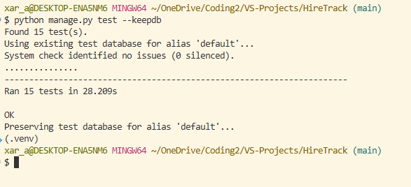
---


# Responsive Testing

HireTrack was manually tested across desktop, tablet and mobile screen
sizes using Google Chrome DevTools and by resizing the browser window.

| Screen Size | Width | Result |
| --- | ---: | --- |
| Desktop | 1440px | ✅  |
| Tablet | 768px | ✅  |
| Mobile | 375px | ✅  |

### Pages Tested

Responsive testing included:

- Home
- Login and Registration
- Dashboard
- Application Details
- Add and Edit Application
- Statistics
- Account Settings
- HireTrack Admin Dashboard

### Elements Tested

The following were checked at each screen size:

- Navigation and account dropdown
- Dashboard cards
- Application tables and mobile cards
- Forms and form controls
- Buttons and action menus
- Status badges
- Footer positioning
- Text wrapping
- Spacing and alignment
- Horizontal overflow

All tested pages remained usable and readable at the selected screen sizes.
Responsive components adapted appropriately between desktop, tablet and
mobile layouts, with no unwanted horizontal scrolling identified during
final testing.


# Responsive Testing

HireTrack was tested for responsive behaviour across desktop, tablet and
mobile screen sizes.

## Manual Responsive Testing

Manual responsive testing was carried out using Google Chrome DevTools and
by resizing the browser window.

| Screen Size | Width | Result |
| --- | ---: | --- |
| Desktop | 1440px | ✅ Pass |
| Tablet | 768px | ✅ Pass |
| Mobile | 375px | ✅ Pass |

The following areas were checked:

- Navigation and account dropdown
- Dashboard cards
- Application tables and mobile cards
- Forms and form controls
- Buttons and action menus
- Status badges
- Footer positioning
- Text wrapping
- Spacing and alignment
- Horizontal overflow

## Am I Responsive Testing

The deployed HireTrack application was also tested using **Am I Responsive**
to provide a visual check of the website across multiple device sizes.

Because the deployed application prevents being displayed inside an iframe
by default, the **Ignore X-Frame headers** Chrome extension was temporarily
used in the local testing browser.

With the extension enabled, the deployed HireTrack website could be loaded
successfully within Am I Responsive without the previous X-Frame error.

The extension was used only within the tester's browser to allow the
responsive preview to be displayed. No production security settings were
removed or changed in the HireTrack application for this test.

The responsive preview confirmed that the deployed application could be
displayed across the desktop, laptop, tablet and mobile device previews.

### Responsive Testing Evidence

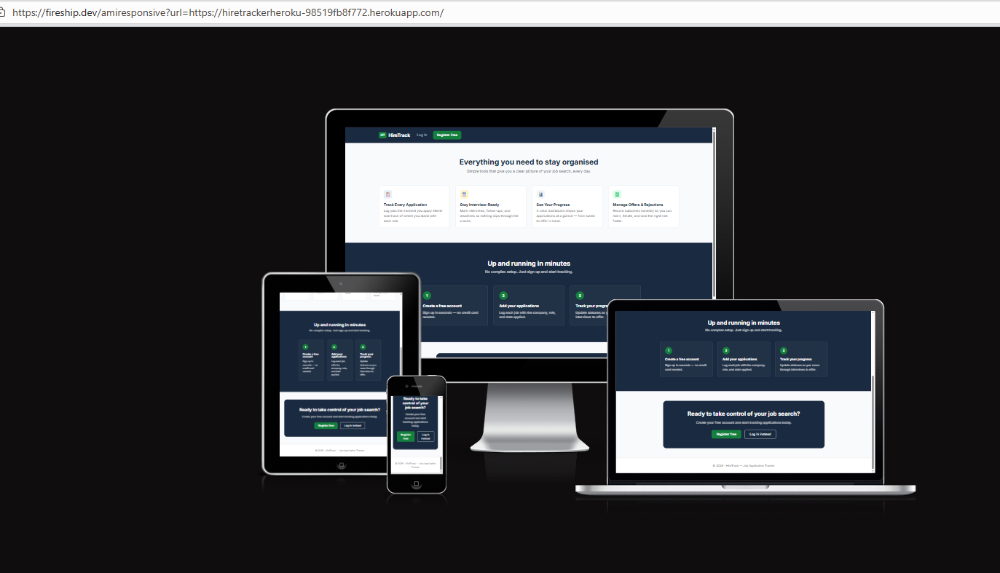

## Lighthouse Testing

Google Lighthouse was used separately to assess the deployed application
for:

- Performance
- Accessibility
- Best Practices
- SEO

Lighthouse results are documented in the Lighthouse Testing section below.
### Lighthouse Responsive Testing
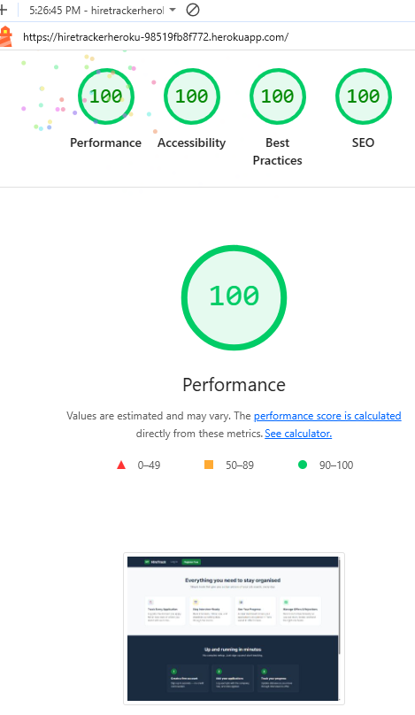
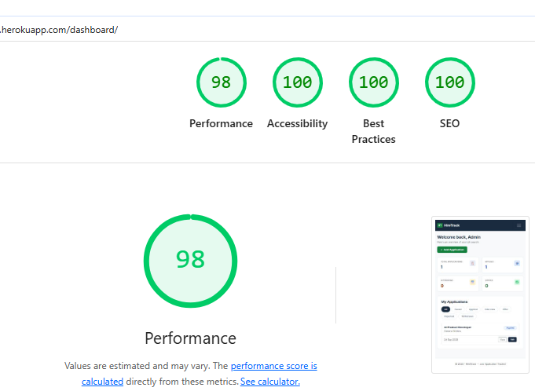

---

# Browser Testing

| Browser | Device                     | Result | Pass/Fail |
| ------- | -------------------------- | ------ | --------- |
| Chrome  | Desktop                    |   Pass |   ✅      |
| Firefox | Desktop                    |   Pass |   ✅      |
| Edge    | Desktop                    |   Pass |   ✅      |


# Browser Testing Evidence

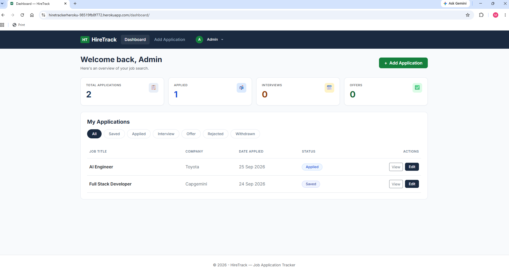
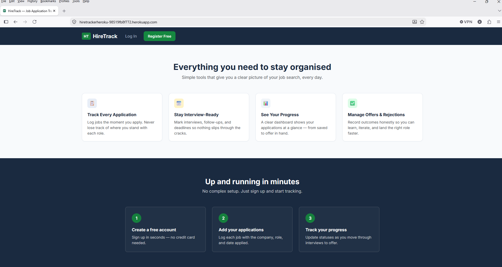
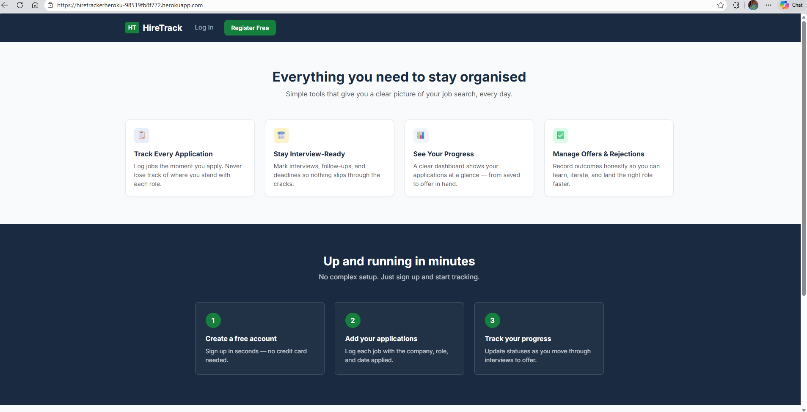

---

## HTML Validation

HTML validation was carried out using the W3C Markup Validation Service. As the project uses Django templates, each page was rendered in the browser and the generated HTML source was copied into the validator using Direct Input.

| Page | Template | Result |
| --- | --- | --- |
| Home | `application/home.html` | ✅ Pass / |
| Dashboard | `application/dashboard.html` | ✅ Pass / 
| Empty Dashboard | `application/empty-dashboard.html` | ✅ Pass /  
| Add Application | `application/add-application.html` | ✅ Pass / 
| Application Details | `application/application-details.html` | ✅ Pass /
| Edit Application | `application/edit-application.html` | ✅ Pass / 
| Delete Application | `application/delete-confirmation.html` | ✅ Pass |
| Statistics | `application/statistics.html` | ✅ Pass /
| Account Settings | `application/account-settings.html` | ✅ Pass  |
| Admin Dashboard | `application/admin-dashboard.html` | ✅ Pass |
| Admin User Details | `application/admin-user-detail.html` | ✅ Pass  |
| Admin Delete User | `application/admin-delete-user.html` | ✅ Pass  |
| Login | `registration/login.html` | ✅ Pass  |
| Registration | `registration/registration.html` | ✅ Pass  |
| 403 Error | `error/403.html` | ✅ Pass |
| 404 Error | `error/404.html` | ✅ Pass |
| 500 Error | `error/500.html` | ✅ Pass  |
|
### HTML Validation Evidence
The screenshots below show examples of successful HTML validation using the W3C Markup Validation Service. Each Django template was rendered in the browser and the generated HTML was tested using the validator's Direct Input option.

#### homepage


#### Dashboard


#### Registration
       

#### Admin Dashboard


#### 404 Error Page


# CSS Validation

CSS was validated using.


| File      | Result | Errors | Resolution |
| --------- | ------ | ------ | ---------- |
| style.css |    Pass  None   |      ✅   |

---
### CSS Validation Evidence


# Python Validation

Python code was checked for PEP 8 compliance using:
* [flake8](https://flake8.pycqa.org/en/latest/)
* black (for formatting)
* https://pep8ci.herokuapp.com/

Python code quality was checked using a combination of **Flake8**, **Black**, and the **Code Institute Python Linter**. These tools were used to identify formatting and PEP8 issues and to keep the Python code consistent and readable.

### Flake8

Flake8 was used locally during development to check the Python files for PEP8 style issues and common coding errors.
Flake8 was installed inside the project's virtual environment using:

```bash
pip install flake8
``` 
Individual files were then checked from the project root. For example:
flake8 applications/views.py
flake8 applications/forms.py
flake8 applications/models.py
flake8 applications/tests.py
flake8 applications/urls.py

Flake8 was useful because it provided the exact file, line number and type of issue detected. This made it easier to correct problems such as:
- E501 - lines longer than the permitted length.
- E302 - incorrect number of blank lines between functions.
- W291 - trailing whitespace.
- W293 - whitespace on otherwise blank lines.
- Unused imports and other common Python issues.
Black
Black was used as an additional formatting tool to help maintain consistent Python formatting.
It was installed in the virtual environment using:
pip install black

Because the project was being checked against a 79-character line length, Black was run with the following option where appropriate:
black --line-length 79 applications/views.py

After using Black, Flake8 was run again to check for any remaining issues.
Black was used carefully because it automatically reformats files. Changes were reviewed and the application was tested afterwards to ensure that formatting changes had not affected the application's functionality.
Code Institute Python Linter
The Code Institute Python Linter was used as the final validation check for the project's Python files.
The Python code was copied into the linter and any reported issues were reviewed and corrected. Files were checked again after corrections until the relevant validation issues had been resolved.
Using the Code Institute Python Linter alongside Flake8 provided an additional final check that the submitted Python code followed the expected formatting standards.
Why Multiple Tools Were Used
Each tool served a slightly different purpose during testing:
- Flake8 provided fast local feedback and identified specific PEP8 and code-quality issues while working in VS Code.
- Black helped automatically produce consistent formatting and reduce manual formatting work.
- Code Institute Python Linter provided the final validation check against the standards expected for the project submission.
Using these tools together helped improve the consistency, readability and maintainability of the Python code while allowing validation issues to be identified before deployment.
```

Using these tools together helped improve the consistency, readability and
maintainability of the Python code while allowing validation issues to be
identified before deployment.

# Python Validation Evidence

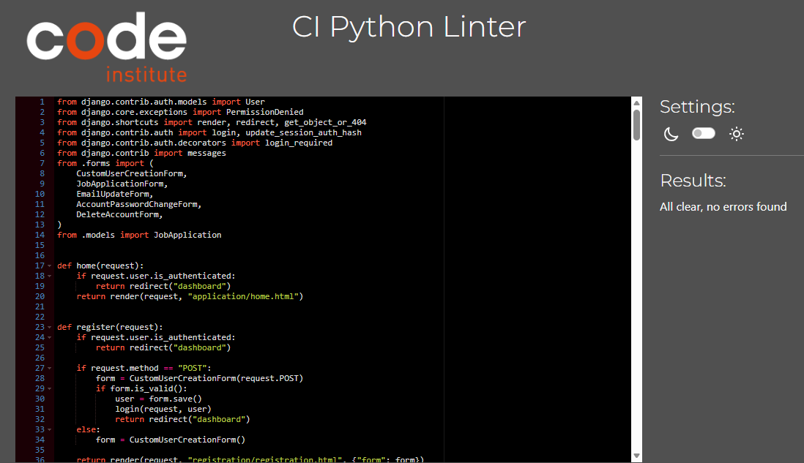

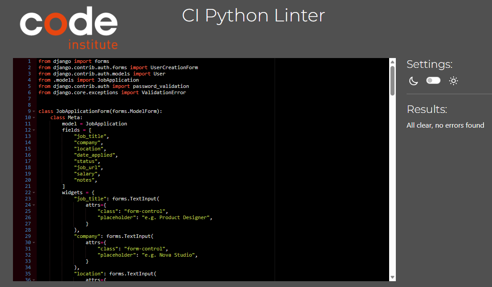

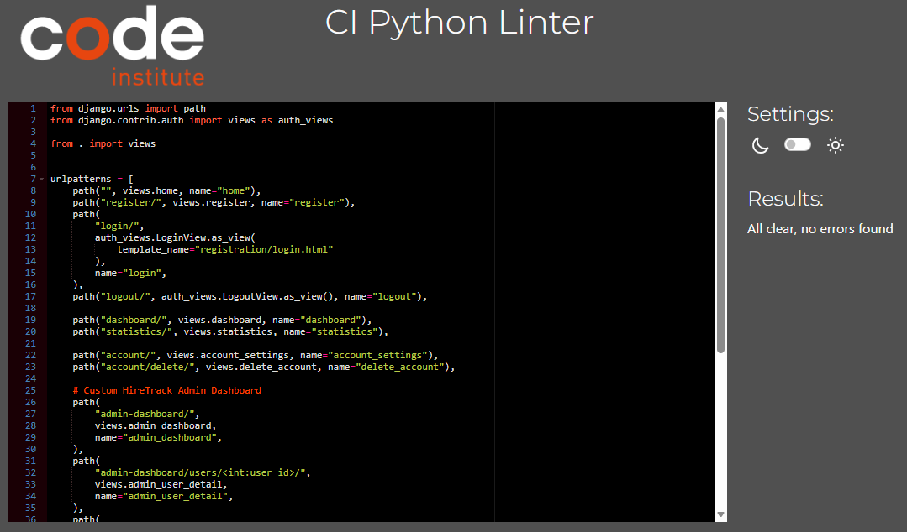

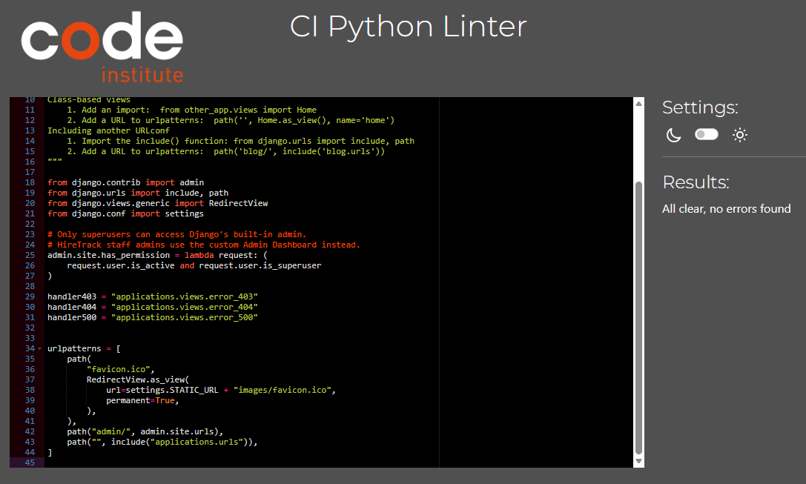

## Automated Testing

Automated testing was carried out using Django's built-in testing framework.

The tests are contained in:

`applications/tests.py`

The automated tests were designed to check important parts of the HireTrack
application, including model behaviour, views, authentication, access control
and application functionality.

### Running the Tests

The project's virtual environment was activated before running the test suite.

The tests can be run from the project root using:

```bash
python manage.py test
```

## Automated Testing Evidence


## JavaScript Validation

No custom JavaScript was written for this project. Interactive components, such as the responsive navigation and dropdown menus, use Bootstrap's JavaScript bundle.

As no project-specific JavaScript files were created, JavaScript validation was not required.


---

# Bugs

## Fixed Bugs

Document meaningful bugs encountered during development.

| Bug | Cause | Fix | Status |
| --- | ----- | --- | ------ |
|     |       |     | Fixed  |

Example structure:

### Application permissions bug


| Bug / Issue | Fix |
| --- | --- |
| Nested `<main>` elements caused HTML validation errors | Kept the single `<main>` in `base.html` and changed child templates to use `<div>` |
| Login page had an unclosed `<div>` | Corrected the HTML structure and revalidated the rendered page |
| Duplicate `id_current_password` on Account Settings | Gave the delete-account password field its own unique ID |
| Admin Dashboard overflow/layout issues on tablet | Added tablet-specific responsive styling and adjusted table columns/spacing |
| Long content overflowed mobile application cards | Added wrapping and flex constraints so long text remained inside the card |
| Account dropdown positioning was poor on small mobile screens | Added a mobile-specific dropdown positioning rule |
| Error pages produced unnecessary vertical scrolling | Removed the extra viewport-based `min-height` from `.error-page` |
| Empty/wrong warning icon appeared on delete confirmation | Removed/corrected the unnecessary icon |
| HireTrack Admin permissions needed tightening | Restricted the custom dashboard to staff non-superusers and prevented admins from viewing/deleting other admin accounts |
| Django Admin access needed stricter role separation | Restricted Django's built-in Admin interface to superusers |
| Python validation reported Flake8 issues | Removed an unnecessary import and corrected formatting/line-length/whitespace issues; Black was also used |
| Django tests passed but PostgreSQL test database cleanup failed | Identified it as a Neon/PostgreSQL connection teardown issue after all 15 tests had passed; `--keepdb` was used for subsequent testing |
| Static CSS changes did not immediately appear with `DEBUG=False` | Ran `collectstatic` so the updated source CSS was copied to the collected static files |


---

## Known Bugs

At the time of final testing, no known unresolved bugs were identified in
the HireTrack application.

Issues discovered during development were addressed and retested before
the final deployment. These included HTML validation issues, responsive
layout problems, form field ID conflicts, static file updates and
role-based access restrictions.

All 15 automated Django tests passed during final testing. Manual testing
was also carried out across the application's main functionality and
responsive layouts.

Any future issues discovered after deployment will be documented and
addressed in subsequent development.


### Duplicate Form Field ID

**Issue:**  
During W3C HTML validation of the Account Settings page, a duplicate
`id_current_password` error was identified.

The page contains two separate forms that request the user's current
password:

- Change Password
- Delete Account

Django initially generated `id="id_current_password"` for both fields,
resulting in duplicate HTML IDs on the same page.

**Fix:**  
A unique widget ID was assigned to the current password field in the
`DeleteAccountForm`:

```python
"id": "id_delete_current_password"
``` 
The delete-account password field therefore renders with a unique ID,
while the Change Password form retains the original id_current_password.
The associated label uses Django's id_for_label, ensuring that it
continues to reference the correct input.
Result:
The duplicate ID was removed and the rendered Account Settings page was
revalidated successfully.
Status: ✅ Fixed


---
For information about the application, design process, deployment, and development methodology, 
see the main [README.md](README.md) file.
